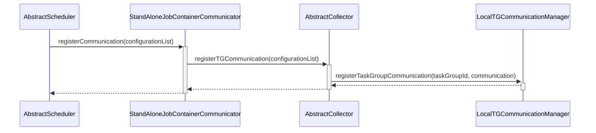
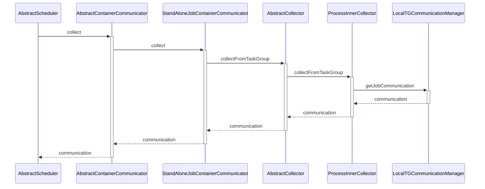

## Datax 数据统计原理

根据datax的运行模式的区别， 数据的收集会有些区别，这篇文章都是讲的在standalone模式下。

## 统计数据类

DataX所有的统计信息都会保存到Communication类里面。Communication支持下列数据的统计

- 计数器，比如读取的字节速度，写入成功的数据条数
- 统计的时间点
- 字符串类型的消息
- 执行时的异常
- 执行的状态， 比如成功或失败

Communication有下列属性保存统计数据

```java
// 计数器
private Map<String, Number> counter;

// 执行状态
private State state;

// 异常记录 
private Throwable throwable;

//在哪个时间点统计数据
private long timestamp;

// 消息集合
Map<String, List<String>> message;
```


如果需要汇总多个Communication的数据，Communication提供了mergeFrom方法。根据不同的数据类型，对应着不同的操作

- 计数器类型，相同的key的数值累加
- 合并异常，当自身的异常为null，才合并别的异常
- 合并状态，如果有任意一个的状态失败了，那么返回失败的状态。如果有任意一个的状态正在运行，那么返回正在运行的状态
- 合并消息， 相同的key的消息添加到同一个列表

 

## Communication管理

对于每个task组都有一个单独的Communication，用来存储这个组的统计数据。对于这些Communication，LocalTGCommunicationManager类实现了集中管理。接下来看看LocalTGCommunicationManager的原理。

LocalTGCommunicationManager有个重要的属性 taskGroupCommunicationMap， 它是一个Map，保存了每个task组的统计数据。

```java
public final class LocalTGCommunicationManager {
    // Key为task group id， Value为对应的Communication
    private static Map<Integer, Communication> taskGroupCommunicationMap =
        new ConcurrentHashMap<Integer, Communication>();
}
```

当task组在初始化的时候，都会向LocalTGCommunicationManager这里注册。

```java
// 这里只是简单保存到taskGroupCommunicationMap变量里
public static void registerTaskGroupCommunication(
        int taskGroupId, Communication communication) {
    taskGroupCommunicationMap.put(taskGroupId, communication);
}
```

当需要统计所有的数据时，getJobCommunication实现了这个功能

```java
    public static Communication getJobCommunication() {
        // 初始一个新的Communication，然后更新它的数据
        Communication communication = new Communication();
        communication.setState(State.SUCCEEDED);
        // 遍历所有任务的Communication， 调用mergeFrom合并统计结果
        for (Communication taskGroupCommunication :
                taskGroupCommunicationMap.values()) {
            communication.mergeFrom(taskGroupCommunication);
        }

        return communication;
    }
```


## 注册Communication

AbstractScheduler会根据切分后的任务，为每个task组注册一个Communication。registerCommunication接收task配置列表，里面每个配置都包含了task group id。




## 更新统计数据

每个任务执行都会对应着Channel，Channel当每处理一条数据时，都会更新对应Communication的统计信息。

比如下面的pull方法是Writer从Channel拉取数据，每次pull的时候，都会调用statPull函数，会更新写入数据条数和字节数的信息。

```java
public abstract class Channel {

	private Communication currentCommunication;
    
    public Record pull() {
        Record record = this.doPull();
        this.statPull(1L, record.getByteSize());
        return record;
    }

    private void statPull(long recordSize, long byteSize) {
        currentCommunication.increaseCounter(
                CommunicationTool.WRITE_RECEIVED_RECORDS, recordSize);
        currentCommunication.increaseCounter(
                CommunicationTool.WRITE_RECEIVED_BYTES, byteSize);
    }
```


## 收集数据

1. AbstractScheduler想统计汇总后的数据，需要调用AbstractContainerCommunicator的collect方法

2. StandAloneJobContainerCommunicator继承AbstractContainerCommunicator，实现了collect方法，

   它会调用AbstractCollector的collectFromTaskGroup方法获取数据

3. ProcessInnerCollector实现了AbstractCollector的collectFromTaskGroup方法，它会调用LocalTGCommunicationManager的getJobCommunication方法

4. getJobCommunication方法会统计所有task的数据，然后返回。




