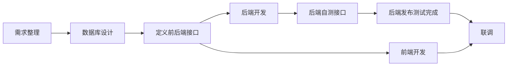
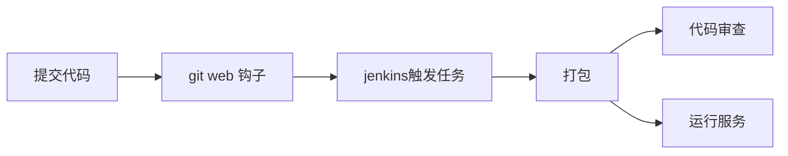

## 前言

最近在开发一个电商项目，再加上生活上的一些琐事，学习时间完全没有了。忙了几个月，项目终于要接近尾声了，想着抽点空总结下项目，也顺便水一篇博客。这篇文章只是粗略得讲解整个项目开发流程，里面的有些设计细节后面博客会讲到。

## 项目开发流程

关于项目环境，因为开发人数比较少，所以我只搭建了一个开发环境，也作为测试环境使用。

需求整理应该要占整个项目的一定时间，尤其是没有专职产品经理的时候。回顾整个项目，我对于需求整理花费的时间不多，这也往往导致了开发到一半的时候，才发现一些业务的漏洞，又得重新去设计。

数据库我用的是 postgresql，因为它对 json 的支持比较好，还能在 json 上创建索引，这点可以让我的表设计更加灵活。还有设计数据库时，不必将数据设计得过于准确，可以适当的将关系弱化，这样后期往往有更高的扩展性。如果遇到拿不准的情况，可以尽量从表的数据粒度最小化，然后试着慢慢提高粒度。

对于接口定义，我是直接通过编写文档，并没有使用接口管理系统。因为找了一圈，发现并没有合适的，所以最后回归到最原始的方式。文档是通过语雀来管理的，它能支持多种文本绘图，写起来要方便很多。我是先定义了接口文档模板，后面添加的文档都是直接在模板上修改，就可以完成。

当后端开发完成后，需要使用 postman 工具完成自测，确认没问题后，就提交代码到 dev 分支。我使用 jenkins 来完成自动化部署，这样省去了好多时间。当部署完成后，前端就可以直接开始联调了。

## 自动化部署

从上面的流程图，可以看出来代码部署会非常频繁，因为几乎每完成一些接口，就需要立刻部署。这种场景就需要自动化来帮忙了，对于 CI 框架的选择，我直接选择了比较流行的 Jenkins。

我使用 gitea 作为 git 服务来存储代码，因为它相对 gitlab 会更加轻量，而且界面也满足了基本需求。通过配置 web 钩子，每当有代码推送到仓库时，都会触发 jenkins 的自动化部署。

后期我添加了代码审查，使用 sonarqube 作为审查工具。注意到代码审核和运行服务是并行的，需要在 Jenkins  配置 paralle。sonarqube 审查也帮助了我规范了代码，这里额外说下，我因为项目大量使用了 lombok，所以在代码扫描的时候，需要添加`sonar.java.libraries=$HOME/.m2/**/*.jar`参数。

## 系统监控

系统监控使用 prometheus 框架，它不仅支持多种服务的监控，而且也提供了丰富的报警。它实现了对 nginx 的访问请求信息，服务器的基本监控，postgresql 的监控指标。

prometheus 负责采集和存储监控数据，如果要图形化的展示出来，推荐使用 grafana，它支持页面的自定义配置，界面也非常直观。

这一套监控服务比较流行，我就直接看着文档搭建完成了。Prometheus 的原理还没仔细看，希望后面有时间可以深入了解下，尤其是它如何高效的存储时序性数据。

## 重构与设计模式

后期想把之前的代码优化一下，主要侧重于代码的可读性，所以专门花时间看了下 <<设计模式>> 和 <<重构>> 两本书。在尝试将所学习到的知识回馈到项目中时，<<重构>> 这本书带给我的帮助非常大。之前的代码只能说还可以看，算不上简洁，尤其是函数参数的设计很乱。当我按照书中的方法，适当的合并参数到对象里，代码变得要清晰很多。还有多态在项目中用得不多，现在也尝试着将 if 条件语句，通过多态的方式实现。当然还有更多的例子，比如单个大类拆分成多个小类等，这些方法让我的代码更见的简洁好看。当我一步步的优化后，发现不知不觉得就向某种设计模式演变，代码结构自然的就变清晰了。

通过重构的实践，让我意识到了重构和设计模式的关系，如同进行中和终点的关系。重构教会你如何一步一步的向前走，设计模式就是这条路的终点。

## 开发进度

关于项目预估，我经常过于乐观了，导致开发时间非常紧张。还有之前的前端，基础相对较差，为了不拖累进度，我被逼着学习了两个星期的 vue，也帮忙开发了后台界面。后来换了一个前端，我才轻松许多，可以专心做后端了。那段时间的压力比较大，不过熬过了那段时间，我的前端水平进步很快， flex 布局和 vue 框架都学会了，独立开发一个后台系统，已经没什么问题了。

关于时间的分配，我应该多花费一些时间在数据库和需求整理上。当数据库设计好了，接口的开发会非常快的，几乎就是体力活了。还有在写代码的时候，需要经常考虑小步重构，这样会使得代码的可维护性更好，后面再添加功能也会更加快速。