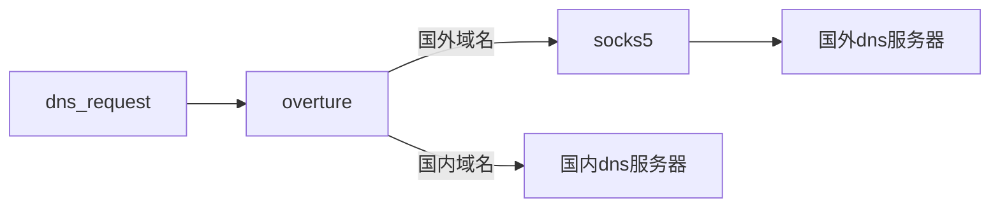
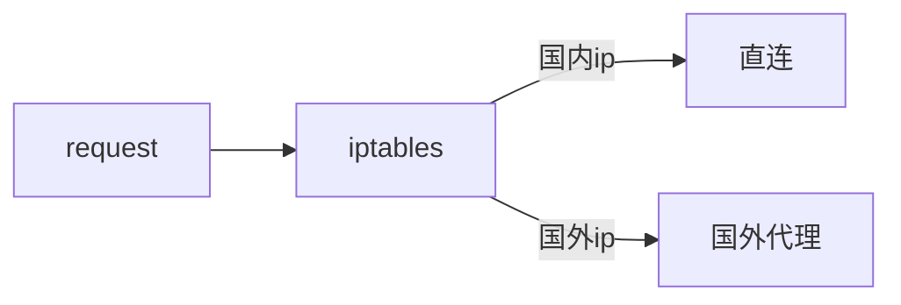

## 前言

最近看到了闲置已久的小米路由器3，可以刷 lede 系统了，就想着做个透明代理来试试。经过两三个星期的折腾，总算是成功了，下面讲解下透明代理实现的方案和原理。


## 网络框架

整个框架由域名解析和 ip 分流两部分组成。域名解析保证了解析的准确性，并且对于国内网站，需要解析到国内 ip，这样才能充分利用直连的优势。比如我们访问哔哩哔哩网站的视频服务，就可以将其转发给`119.29.29.29`来解析，解析的地址就是国内 ip。这样就避免了域名解析到了国外，造成延迟过高。


### 域名解析流程

域名解析保证了解析的准确性，并且对于国内网站，需要解析到国内 ip，这样才能充分利用直连的优势。比如我们访问哔哩哔哩网站的视频服务，就可以将其转发给`119.29.29.29`来解析，解析的地址就是国内 ip。这样就避免了域名解析到了国外，造成延迟过高。

这里使用 overture 开源框架，负责 dns 解析分流。




### 透明代理

使用 iptables 来进行 ip 分流，国内请求直连，国外请求走代理




## 域名服务器

### 域名请求协议

域名请求方式有下列四种协议：

1. udp，标准的dns请求，已经被绝大多数系统支持
2. tcp，请求格式和udp相同，只不过连接改为tcp，因为tpc的三次握手原因，效率没udp高
3. 基于tcp连接的tls加密协议，有效的防止了域名劫持
4. 基于https连接的协议，也可以防止域名劫持，比 tcp-tls 更加主流


对于负责解析国内域名的 dns，比如`119.29.29.29`，建议使用 udp 方式 。因为这种方式是非常高效的。

对于国外域名，则需要转发给国外的 dns。 但是因为 udp 方式的请求，是明文传输，很容易被劫持，所以这里需要采用 tcp-tls 或者 https 方式。


### overture 配置

这里采用 overture 开源框架进行分流，是因为它支持后缀树的算法匹配，效率非常高。这里使用了`felixonmars`同学整理好的国内域名列表，来区分网内外网站。

```shell
git clone https://github.com/felixonmars/dnsmasq-china-list.git
cd dnsmasq-china-list
# 提取原始域名列表
make raw
# google有些服务可以在国内使用
cat  google.china.raw.txt >> china-domain.txt
# apple有些服务可以在国内使用
cat apple.china.raw.txt >> china-domain.txt
# 国内域名列表
cat accelerated-domains.china.raw.txt >> china-domain.txt
```


因为 overture 项目不支持 https 方式，所以我自己修改源码，目前已经提交 pull request，等待合并中。还有一点是，overture 不能仅仅通过域名来决定转发给哪个 dns，我也提交了 pull request。如果想要使用的话，得要自行编译或者等待作者合并。

下面是我的配置文件，可以参考

```json
{
  "BindAddress": ":53",
  "DebugHTTPAddress": "0.0.0.0:5555",
  "PrimaryDNS": [
    {
      "Name": "DNSPod",
      "Address": "119.29.29.29:53",
      "Protocol": "udp",
      "SOCKS5Address": "",
      "Timeout": 15,
      "EDNSClientSubnet": {
        "Policy": "disable",
        "ExternalIP": "",
        "NoCookie": true
      }
    }
  ],
  "AlternativeDNS": [
    {
      "Name": "Google",
      "Address": "https://dns.google/dns-query",
      "Protocol": "https",
      "SOCKS5Address": "127.0.0.1:7891",
      "Timeout": 60,
      "EDNSClientSubnet": {
        "Policy": "disable",
        "ExternalIP": "",
        "NoCookie": true
      }
    }
  ],
  "OnlyPrimaryDNS": false,
  "IPv6UseAlternativeDNS": false,
  "WhenPrimaryDNSAnswerNoneUse": "AlternativeDNS",
  "DomainFile": {
    "Primary": "./china-domain.txt",
    "Alternative": "",
    "PrimaryMatcher":  "suffix-tree",
    "AlternativeMatcher": "final"
  },
  "HostsFile": "./hosts_sample",
  "MinimumTTL": 60,
  "DomainTTLFile" : "",
  "CacheSize" : 2000,
  "RejectQType": [255]
}
```


当有域名请求过来时，会先去国内域名列表中匹配，如果找到了，那么转发给`119.29.29.29`服务。注意到`PrimaryMatcher`必须设置为`suffix-tree`，这样才能高效的匹配。

还应该注意到`AlternativeMatcher`必须为`final`，表示其余的域名都由它来处理。如果不设置，那么`overture`会向`119.29.29.29`请求获取该域名的 ip ，然后再根据 ip 来选择哪个 dns，显然这没有任何意思。

还要开启缓存，通过设置`CacheSize`的大小即可，这里设置为 2000 即可。

对于国外 dns，需要设置 socks5 代理才能访问。并且设置`Timeout`为 60s，因为访问国外的服务器是比较不稳定的，所以设置的比较高。


## 透明代理

在配置好域名服务器后，我们就可以获得域名的准确 ip。 如果 ip 是在国内，那么采用直连模式。如果是在国外，那么需要转发给 redir 端口。对于端口转发，使用 iptables 最为高效方便。对于大量 ip 匹配，采用 ipset 非常高效。


### ipset 配置

ipset 可以使用哈希表来高效的匹配 ip，这里需要创建一个国内 ip 集合

```shell
# 下载国内ip数据
wget https://raw.githubusercontent.com/metowolf/iplist/master/data/special/china.txt

# 创建集合，叫做China，类型为net，表示支持ip和网段
ipset -N China hash:net

# 遍历ip，添加到集合
for i in `cat china.txt `
do
  ipset -A China $i
done

# 持久化ipset，防止机器重启无效
ipset save > /etc/ipset.conf
```

```shell
# 下载国内ip数据
wget https://raw.githubusercontent.com/metowolf/iplist/master/data/special/china.txt

# 创建集合，叫做China，类型为net，表示支持ip和网段
ipset -N China hash:net

# 遍历ip，添加到集合
for i in `cat china.txt `
do
  ipset -A China $i
done

# 持久化ipset，防止机器重启无效
ipset save > /etc/ipset.conf
```


### iptables 配置 

iptables 会实现透明代理

```shell
# 创建DIRECT_TCP规则
iptables -t nat -N DIRECT_IP

# 放行环回地址，
iptables -t nat -A DIRECT_IP -d 0/8 -j RETURN
iptables -t nat -A DIRECT_IP -d 127/8 -j RETURN
# 放行局域网地址，因为我的局域网地址为192.168网段，所以只需要匹配它
iptables -t nat -A DIRECT_IP -d 192.168/16 -j RETURN

# 放行 socks5 port，我的socks服务运行在7891端口
iptables -t nat -I DIRECT_IP -p tcp --dport 7891 -j RETURN

# 放行国内ip
iptables -t nat -A DIRECT_IP -m set --match-set China dst -j RETURN

# 重定向 tcp 数据包至 redir 端口，我的redir服务运行在7892端口
iptables -t nat -A DIRECT_IP -p tcp -j REDIRECT --to-port 7892

# 添加到 PREROUTING 链条
iptables -t nat -A PREROUTING -p tcp -j DIRECT_IP
```


## 路由器系统

因为这里使用的几个软件都是 golang 开发的，它支持跨平台，我们需要找到自己设备对应的平台版本。路由器的芯片不相同，其对应的系统平台也不一样。一般根据芯片生产商来区分，比如 mtk 芯片的一般都是 mips平台，博通或者高通芯片一般都是 arm 平台。

因为我使用的是小米路由器3，它的芯片是 mtk 的，并且通过查看`cat /proc/cpuinfo`可以看到是小端字节，所以它对应的 golang 语言平台是 mipsle，softfloat。


## 路由器设置

我使用的是小米路由器3，刷了 lede 系统。下面是安装注意细节：


### 开启ssh访问

在管理页面上，点击 系统 -> 管理权，然后选择 ssh 访问子页，勾选**密码验证**，和**允许 root 用户凭密码登录**。接下来的步骤都需要 ssh 到路由器上操作。


### 安装 https 库

因为域名服务器使用了 https 方式进行域名解析，所以还需要安装与 https 相关的库。

```shell
opkg update
opkg install ca-certificates openssl-util ca-bundle
```


### 域名服务启动

下载 overture 和 国内域名列表，上传到路由器上，并且修改好配置文件。

因为路由器内置了 dnsmasp 服务，占用了 53 端口，这里需要将其停掉。进入路由器管理页面上，依次点击 网络 -> `DHCP/DNS` -> 高级设置，然后将**DNS 服务器端口**设置为 0，就可以停掉了。

另外还需要修改 dhcp 相关配置，来告诉接入设备 dns 地址。还是进入路由器管理页面上， 依次点击 网络 -> 接口 -> lan ->  编辑 -> `DHCP服务器` -> 高级设置 ，在 `DHCP`选项框，添加一条数据`6,192.168.15.1`。这里 6 是 dhcp 协议标识，表示这条记录指定了 dns 地址，就是后面的 ip 。因为 overture 运行在路由器上，所以这里需要设置为路由器的 ip。

执行下列命令启动 overture

```shell
nohup ./overture-linux-mipsle-softfloat &
```


### 透明代理设置

上面已经讲述过了如何设置透明代理和 ip 分流。


### clash 服务

这里我使用 clash 作为 socks5 和 redir 服务，当然读者可以采用别的框架。


## 性能测试

经过上面的步骤，路由器的透明代理就配置好了。这里使用`http://www.speedtest.cn/`测速，测速地点是国内地址。下载可以达到 74Mbps，上传达到 38.83Mbps。

使用`https://www.speedtest.net/`测速，测速地点是国外地址。下载可以达到45Mbps，上传达到1Mbps。上传速度慢可能是代理限速的原因。

可以看出来，小米路由器3 的性能满足家用是没什么多大问题了。