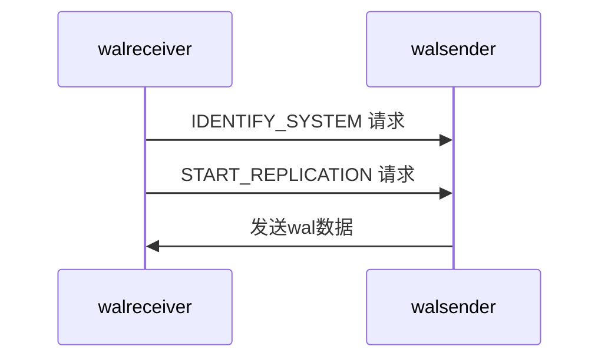
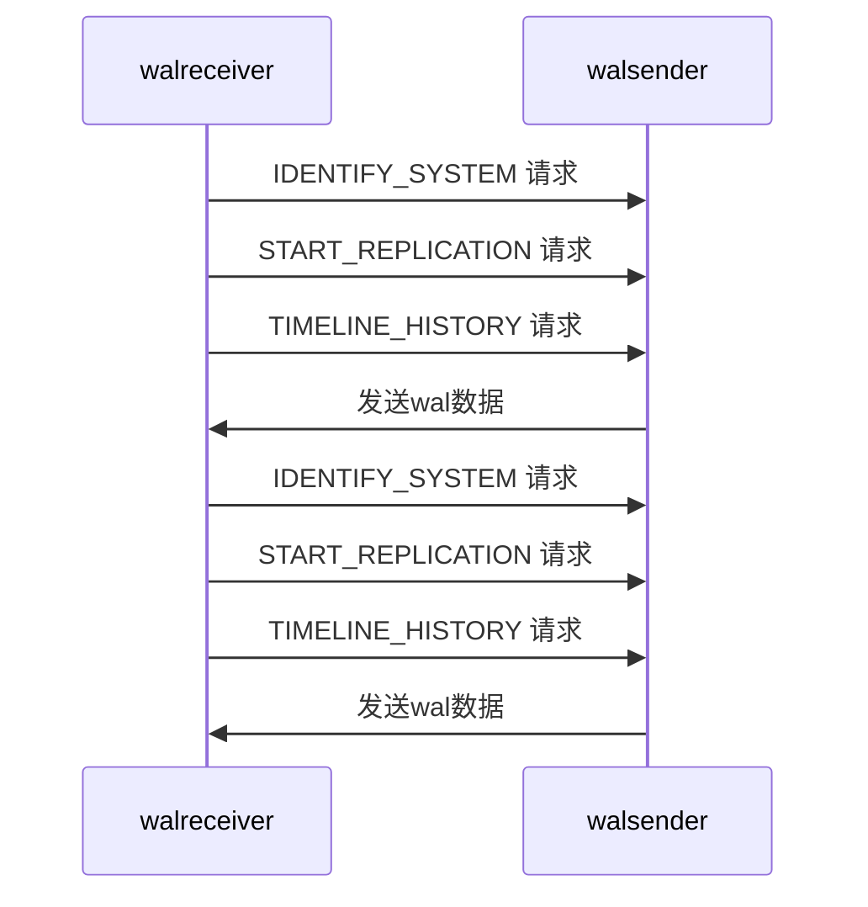

postgresql 提供了主从复制功能，有基于文件的拷贝和基于 tcp 流的数据传输两种方式。两种方式都是传输 wal 数据，前者是等待生成一个完整的wal文件后，才会触发传输，后者是实时传输的。可以看出来基于文件方式的延迟会比较高，而且wal文件有可能没来得及传输就被损坏了，造成了这块的数据丢失。基于 tcp 流的方式，延迟非常低，是现在最常见的方式，本篇文章也主要讲述这种方式。


## 进程启动

当配置好了主从后，我们需要先启动主库，再启动从库。

1. 从库启动后，会创建 walreceiver 进程，然后发送同步请求到主库。
2. 主库收到请求后，会创建 walsender 进程。
3. walsender 进程启动后会和 walreceiver 建立 tcp 连接
4. 主库和从库就依靠这个 tcp 连接进行后续通信

walsender 进程只会运行在主库上，而 walreceiver 进程只会运行在从库上。


## 通信协议

这里继续讲解后续的通信过程，为了让读者理解起来更加容易，会分为简单和复杂两个场景。我们知道 wal 数据是有 timeline 区分的，简单场景就是不包含timeline的切换，复杂场景则会包含。

### 简单场景

下图展示了通信流程：



首先从库会发送`IDENTIFY_SYSTEM`请求，用来确认主库的身份。每个 postgresql 数据库在第一次初始化时，都会分配一个唯一的`systemid`。当配置主从复制时，从库需要将主库的数据备份过来，这时候也会拷贝`systemid`，所以从库和主库的`systemid`是一样的。主库处理`IDENTIFY_SYSTEM`请求时，会返回自身的`systemid`。从库通过匹配它，可以判断出来主库的有效性。比如当用户在配置时错写了主库的地址，就可以检查出来。

从库在确认主库的身份后，就会发送`START_REPLICATION`请求，其中包含了从库想要获取的 wal 数据位置。主库收到请求后，会去检查该 wal 数据是否存在。如果不存在，主库会返回错误信息。从库收到错误信息后，会直接退出。如果发生了这种情况，那么我们则需要重新备份了，重新配置主从复制了。

在确认 wal 数据存在后，主库会传输数据给从库。

### 复杂场景

上面的简单场景只是假设了从库和主库的 timeline 是一致的，如果不一致还有额外的请求过程。如下图所示，主库此时已经变为了 timeline3，而从库因为网络原因断开了，只同步到了 timeline2 的位置时。


现在从库重新启动了，它想追赶到主库的位置，就必须先获取缺失 timeline 的数据。所以从库会先去请求 timeline2 的数据，接着请求 timeline3 的数据，直到与主库保持一致。

整个通信流程如下图：



从库开始会发送`IDENTIFY_SYSTEM`请求，主库会返回响应，包含了`systemid`和此时的`timeline`。从库会检查自身的`timeline`是否等于主库，如果不等于说明从库缺少中间 timeline 的数据。因为 timeline 都是自增的，所以从库只需要依次遍历就行了。从库会发送`TIMELINE_HISTORY`请求，请求获取指定 timeline 的信息。主库会返回这个 timeline 的起始位置。


### 心跳

从库会定期向主库汇报自身的同步进度，比如已经刷新wal数据的位置，已经应用wal数据的位置等，这样主库就可以了解到每个从库的情况。

当主库超过指定时间间隔，没有收到来自从库的消息，会发送`Keepalive`消息，强制要求从库汇报自身进度。


### Replication Slot

当从库长时间落后主库过多，导致主库的wal数据还没出去，就被回收了。这种情况下，需要重新备份主库和重新配置从库。

在现实环境中，主库的数据量会比较大，导致备份的时间长并且对主库造成很大的性能影响。postgresql 针对者这种情况提供了 replication slot，它保存了从库的同步位置。主库在每次回收wal数据时，都会检查 replication slot，确保不会删除从库还未同步的数据。

 replication slot 需要手动在主库中创建，然后在从库中配置。我们在使用 replication slot，需要时刻监控从库的情况，确保从库不会落后太多。否则主库上的 wal 数据不能回收，造成磁盘空间占满，进而会导致主库不能处理写请求。


## 实现原理

上面讲述了主库和从库之间的通信协议，这里继续讲解他们各自内部的实现。

### 从库

#### 进程

从库的同步涉及到 wal 数据的获取和执行，分别由 walreciever 和 recovery 两个进程负责。walreciever 进程负责从主库中获取wal数据，当接收到新的 数据后，会通过 recovery 进程。recovery 进程负责读取并且执行接收的wal 数据。recovery 进程一直会读取新的 wal 数据并且应用，如果没有新的数据，它会阻塞等待 walreceiver 的唤醒。

#### 状态

walreceiver 进程的状态表示从库的同步状态。它在启动的时候，状态为`WALRCV_STARTING`。启动完后，状态变为`WALRCV_STREAMING`。

walreceiver 进程在接收完指定 timeline 的数据后，会变为`WALRCV_WAITING`状态。等待后续指令。

recovery 进程在执行完这个 timeline 的数据后，会将 walceiver 的状态设置为`WALRCV_RESTARTING`。

walreceiver 向主库发起请求，获取下一个 timeline 的数据，状态会变为`WALRCV_STREAMING`。

walreceiver 会一直请求到最近的 timeline，直到和主库保持一致。

walreceiver 的状态会一直保持为`WALRCV_RESTARTING`，直到数据库关闭，变为`WALRCV_STOPPING`。


#### 汇报

从库在空闲时间，会每隔100ms，检查一次。如果超过 `wal_receiver_timeout / 2`的时间，没有收到主库的信息，那么它会强制发送自身的信息到主库，包含自身的wal数据写入位置，刷新位置，应用位置。

如果没有超过，则试图发送自身的信息到主库。这里还需要考虑从库汇报自身信息的最低时间间隔，由`wal_receiver_status_interval`表示，如果小于时间间隔，那么则不会发送。


### 主库

#### 进程

主库在接收到了从库的请求后，会创建 walsender 进程负责处理，walsender 会将 wal 数据发送给从库。当从库已经追赶上了主库，那么 walsender 会等待新的 wal 数据产生。

如果主库处理了来自客户的写请求，产生了新的wal 数据，会唤醒 walsender 进程。


#### 状态

walsender 的初始状态为 `WALSNDSTATE_CATCHUP`，表示从库正在追赶主库。

当从库在追上主库后，状态会变为`WALSNDSTATE_STREAMING`，然后会一直维持这个状态。


#### 心跳

`wal_sender_timeout`表示从库的超时时间，如果从库超过这段时间，一直没有信息，那么主库就会认为它出现了问题，会断开该连接。

如果超过了`wal_sender_timeout / 2`的时间，从库都没反应，那么主库会发送`keepalive`消息给从库，从库必须立即回应。


## 监控指标


### 主库监控

在主库执行下列 sql，可以获得从库的相关信息。不过有些信息都是由从库汇报上来的，比如flush_lsn，replay_lsn，会有一些延迟。

```shell
postgres=# select * from pg_stat_replication;
-[ RECORD 1 ]----+------------------------------
pid              | 22219
usesysid         | 25411
usename          | repl
application_name | walreceiver
client_addr      | 192.168.1.2
client_hostname  | 
client_port      | 35442
backend_start    | 2020-05-06 14:40:58.271771+08
backend_xmin     | 
state            | streaming
sent_lsn         | 0/70209B0
write_lsn        | 0/70209B0
flush_lsn        | 0/70209B0
replay_lsn       | 0/70209B0
write_lag        | 
flush_lag        | 
replay_lag       | 
sync_priority    | 0
sync_state       | async
reply_time       | 2020-05-06 14:41:08.308271+08
```


### 从库监控

```shell
postgres=# select * from pg_stat_wal_receiver;
-[ RECORD 1 ]---------+---------------------------------------------------------------------------------------------------------------------------------------------------------------------------------------------------------------
pid                   | 852
status                | streaming
receive_start_lsn     | 0/7000000
receive_start_tli     | 1
received_lsn          | 0/7000000
received_tli          | 1
last_msg_send_time    | 2020-05-06 14:53:59.640178+08
last_msg_receipt_time | 2020-05-06 14:53:59.640012+08
latest_end_lsn        | 0/70209B0
latest_end_time       | 2020-05-06 14:40:58.293124+08
slot_name             | 
sender_host           | 192.168.1.1
sender_port           | 15432
conninfo              | ...

```


关于上面主控监控中，从库的关于 wal 的恢复信息获取会存在延迟。不过我们可以直接在从库上实时获取，

```shell
postgres=# select pg_last_wal_receive_lsn(), pg_last_wal_replay_lsn(), pg_last_xact_replay_timestamp();
 pg_last_wal_receive_lsn | pg_last_wal_replay_lsn | pg_last_xact_replay_timestamp 
-------------------------+------------------------+-------------------------------
 0/70209B0               | 0/70209B0              | 2020-04-30 17:15:24.425998+08
(1 row)

```

