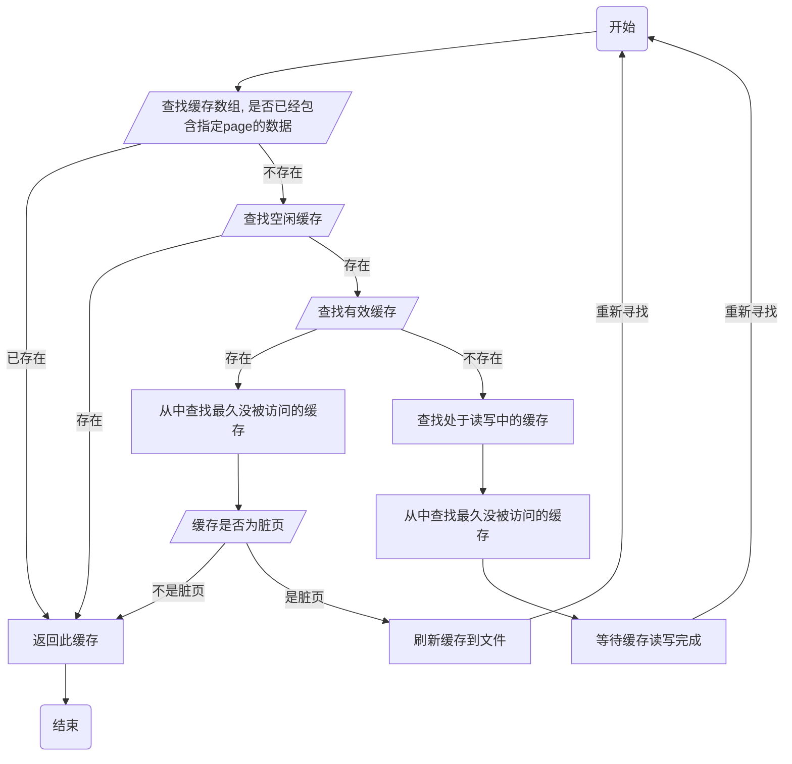

## 前言

简单的 lru 缓存管理（简称 slru），用于持久化数据并且提供 lru 算法来缓存。slru  在 postgresql 存在着多处使用，比如存储事务状态的 clog 日志，就是使用 slru 来管理的。


## 缓存和文件的对应关系

文件的数据都是存储在 page 里，每个 page 的大小都是相同的。这些连续的 page 就构成了文件。

一个缓存对应着一个 page，所以缓存的大小和 page 的大小是相同的。


## 结构体

slru 需要负责文件和缓存两个方面，所以会有两个配置。

### 文件配置

```c
typedef struct SlruCtlData
{
	SlruShared	shared;           // 缓存
	bool		do_fsync;        // 写入数据时，是否需要fsync
	bool		(*PagePrecedes) (int, int);
	char		Dir[64];         // 数据存储的目录
} SlruCtlData;
```


### 缓存配置

```c
typedef struct SlruSharedData
{
	LWLock	   *ControlLock;        /* 用于保存成员的锁 */
	
	int			num_slots;         /* buffer数目 */
	char	  **page_buffer;       /* buffer数组地址 */
	SlruPageStatus *page_status;   /* buffer状态数组*/
	bool	   *page_dirty;       /* 哪些buffer为脏页 */
	int		   *page_number;      /* buffer对应的page num */
	int		   *page_lru_count;   /* 表示buffer的新旧程度，越小表示数据越旧，越有可能被替换 */
	XLogRecPtr *group_lsn;   /* 缓存里的数据对应的xlog日志的位置 */
	int			lsn_groups_per_page;  /* 每个缓存包含的xlog日志位置的数量 */
	int			cur_lru_count;        /* 用于设置buffer的新旧程度 */
	int			latest_page_number;   /* 文件中最新的page num */
	int			lwlock_tranche_id;
	char		lwlock_tranche_name[SLRU_MAX_NAME_LENGTH];
	LWLockPadded *buffer_locks;   /* buffer读写锁数组 */
} SlruSharedData;
```


缓存的状态有下面四种，由`SlruPageStatus`表示

```c
typedef enum
{
	SLRU_PAGE_EMPTY,			/* 空闲状态 */
	SLRU_PAGE_READ_IN_PROGRESS, /* 正在读取数据到缓存 */
	SLRU_PAGE_VALID,			/* 正常状态，里面包含了数据，没有进行读写操作 */
	SLRU_PAGE_WRITE_IN_PROGRESS /* 缓存正在写入文件 */
} SlruPageStatus;
```


## 设置最新访问

既然 slru 使用 lru 算法来管理缓存，那么我们需要了解下它是如何实现的。postgresql 提供了 `SlruRecentlyUsed`宏，来标记缓存为最近被访问了，通过它的定义就可以知道实现原理了。

```c
// share参数是SlruSharedData类型，slotno参数指明哪个buffer
#define SlruRecentlyUsed(shared, slotno)	
do { 
    // 获取cur_lru_count数值
    int		new_lru_count = (shared)->cur_lru_count; 
    if (new_lru_count != (shared)->page_lru_count[slotno]) {
        // 自增cur_lru_count数值
        (shared)->cur_lru_count = ++new_lru_count;
        // 更新指定buffer的page_lru_count
        (shared)->page_lru_count[slotno] = new_lru_count; 
    } 
} while (0)
```

`SlruRecentlyUsed`宏只是将全局的`cur_lru_count`自增，然后提高指定 buffer 的`page_lru_count`。这里需要注意`page_lru_count`属性，通过它的大小，就可以判断出缓存是否最近被访问了。`page_lru_count`越大，就代表着数据最近被使用过。当要替换掉长时间不在访问的 buffer 时，就选择`page_lru_count`值小的。

当每次读取到缓存时，就会调用`SlruRecentlyUsed`设置为最近访问。


## 挑选空闲缓存

当我们需要读取指定 page 的数据时，需要经过下图的步骤。整体思想分为三部分：

1. 如果 page 数据已经存储在缓存中，则直接返回
2. 如果有空闲状态的缓存，则直接返回
3. 如果有不处于读写的缓存，则从中挑选出一个
4. 等待缓存读写完成




## 文件读写

### 文件格式

我们以`pg_xact`目录为例，它使用 slru 存储事务状态信息。

```shell
[root@pt-java data]# ls pg_xact/
0000 0001
```

这个目录存在了多个文件，这些文件称作 segment，文件名称表示 segment 的编号，由4 个十六进制数字组成。数据都是存储在`page`单元里，`page`的大小是固定的，默认 8KB。多个`page`组织成了一个 segment 文件，每个 segment 文件的大小也是固定的，它包含了相同数目的`page`。


### 读取数据

`SlruPhysicalReadPage`负责读取指定 page 的数据。它会确定数据位于哪个 segment 文件，还有所在文件的偏移量。然后打开文件读取。

```c
/*
 * 参数pageno指定page的编号
 * 参数slotno指定读取数据到哪个buffer
 */
static bool SlruPhysicalReadPage(SlruCtl ctl, int pageno, int slotno)
{
    // SLRU_PAGES_PER_SEGMENT表示segment文件包含的page数目，默认为32
    // 计算属于哪个segment文件
    int			segno = pageno / SLRU_PAGES_PER_SEGMENT;
    // 计算属于文件内的第几个page
    int			rpageno = pageno % SLRU_PAGES_PER_SEGMENT;
    // BLCKSZ表示page的大小，默认8K
    int			offset = rpageno * BLCKSZ;
    
    // 生成segment文件路径，文件目录等于SlruCtl的Dir成员，文件名格式为segno的16进制数
    SlruFileName(ctl, path, segno);
    // 打开文件，并且移动读取位置，然后读取到缓存
    fd = OpenTransientFile(path, O_RDONLY | PG_BINARY);
    lseek(fd, (off_t) offset, SEEK_SET);
    read(fd, shared->page_buffer[slotno], BLCKSZ);
}
```


### 写入数据

`SlruPhysicalWritePage`负责将刷新指定缓存到磁盘。它的原理同读取数据相同，也是先定位文件的位置，然后打开文件写入。这里多了一个参数`SlruFlush`，用于一次性刷新所有脏页时，避免重复打开相同文件。

```c
static bool SlruPhysicalWritePage(SlruCtl ctl, int pageno, int slotno, SlruFlush fdata); 
```

在写入磁盘之前，会将这个缓存里所有数据，对应的 xlog 刷新文件中。最简单的一种实现方式，就是找到 xlog 位置最大的值，然后调用`XLogFlush`函数，将指定位置之前的 xlog 都刷新。


## 读写锁

slru 在读取数据或者写入数据的时候，为了防止并发引起的错误，都采用了锁机制。它有两种锁，一种是`SlruSharedData`的`ControlLock`全局锁，另一种是每个缓存对应的读写锁。

`ControlLock`是读写锁`LwLock`，在读取数据时或者刷新缓存到文件的时候，都会获取它的写锁。它是所有缓存共享的，所以叫做全局锁。


### 刷新缓存

刷新缓存的流程：

1. 获取`ControlLock`的全局锁
2. 设置缓存的状态为正在写入中，并且清除脏页标记
3. 获取缓存的写锁
4. 释放`ControlLock`的全局锁，因为刷新磁盘的时间会很长，这里释放全局锁提高并发性能
5. 刷新缓存到文件
6. 重新获取`ControlLock`全局锁，因为接下来要修改缓存的状态
7. 设置缓存的状态为有效状态
8. 释放缓存的写锁
9. 释放`ControlLock`全局锁


### 读取数据

读取数据到缓存的流程：

1. 获取`ControlLock`的全局锁
2. 挑选出替换的缓存，更新缓存的状态为正在读
3. 获取缓存的写锁
4. 释放`ControlLock`的全局锁，因为刷新磁盘的时间会很长，这里释放全局锁提高并发性能

5. 从文件中读取数据到缓存
6. 重新获取`ControlLock`全局锁，因为接下来要修改缓存的状态
7. 设置缓存的状态为有效状态
8. 释放`ControlLock`全局锁
9. 释放缓存的写锁
10. 并且设置缓存为最近访问

