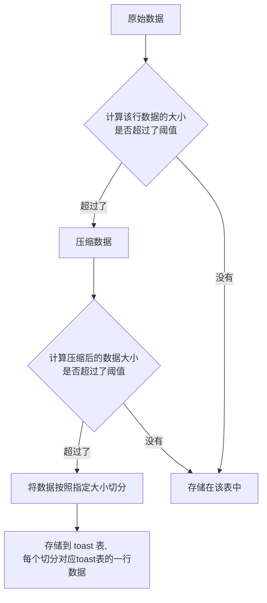

## 前言

上篇博客讲述了 postgresql 如何存储变长数据，它的应用主要是在 toast 。Toast 在存储大型数据时，会将它存储在单独的表中（称为 toast 表）。因为 postgresql 的 tuple（行数据）是存在在 Page 中的，Page 的大小默认为 8KB。postgresql 不允许 tuple 跨页存储，所以当一行数据的某个列数据过大时，比如 text 类型的数据，超过了单页的大小，那么 postgresql 会将它压缩，切分，并且存储在另外的位置。这种技术就是称为 Toast。


## Toast 表

如果我们创建了一张表，有了变长数据的列，那么就会有一个对应的 toast 表，专门存储过大的数据。下面展示了一个例子

```sql
test=# \d mytable
              Table "public.mytable"
 Column |  Type   | Collation | Nullable | Default 
--------+---------+-----------+----------+---------
 id     | integer |           | not null | 
 name   | text    |           |          | 
Indexes:
    "mytable_pkey" PRIMARY KEY, btree (id)
```

可以看见 mytable 有个变长数据类型的列 name。然后我们来看看表对应的 oid。

```sql
test=# select oid from pg_class where relname = 'mytable';
  oid   
--------
 127295
(1 row)
```

可以看到 mytable 表的 oid 为 127295，那么可以推断出它的 toast 表名称为 pg_toast_127295，其对应的 oid 仍然可以通过上述语句查出来（在此省略了），或者

```sql
test=# select reltoastrelid from pg_class where relname = 'mytable';
 reltoastrelid 
---------------
        127298
(1 row)
```


我们继续来看看 pg_toast_127295 表有哪些列

```sql
test=# select attname, typname from pg_attribute inner join pg_type ON pg_type.oid = pg_attribute.atttypid where pg_attribute.attrelid = 127298;
  attname   | typname 
------------+---------
 chunk_data | bytea
 chunk_seq  | int4
 chunk_id   | oid
 tableoid   | oid
 ctid       | tid
 xmin       | xid
 xmax       | xid
 cmin       | cid
 cmax       | cid
(9 rows)
```

除去下面的通用属性，它只定义了三列

| 列名       | 数据类型 | 注释                     |
| ---------- | -------- | ------------------------ |
| chunk_id   | oid      | 数据的 id                |
| chunk_seq  | int4     | 序列 id，表示第几个切片  |
| chunk_data | bytea    | byte数组，表示存储的数据 |


## 切分数据




假设现在向 mytable 表插入一条大型数据，长度为3MB，里面存储了一张图片，采用了base64格式。

```sql
INSERT INTO mytable (name) values ('j7161gnb1u23 ...... 972bh6==');
```

postgresql 在处理这条请求时，发现 name 是 text 类型，并且这次插入的数据过大。那么首先它会被压缩，假设被压缩成 1MB，压缩后仍然不满足大小，然后按照指定的大小（默认为 2048 byte）切分成 512 份。每一份切片对应 toast 表的一行数据，它们的 chunk_id 都是相同的，因为属于同一个数据，只是 chunk_seq 不同，对应着切片位置。chunk_data 列就是存储着切片的数据。


## 数据结构

下面的图展示了普通表的 heap 数据和 toast 表的数据联系。


 toast 表的数据格式在上面已经讲解过了，这里详细介绍了普通表的数据格式，它存储了 toast 表的对应数据位置。首先它是 varattrib_1b_e 数据类型，

```c
typedef struct
{
	uint8		va_header;		
	uint8		va_tag;			/* 类型 */
	char		va_data[FLEXIBLE_ARRAY_MEMBER];
} varattrib_1b_e;
```

它的 va_tag 类型为 `VARTAG_ONDISK `，后面的 `va_data`数据格式如下：

```c
typedef struct varatt_external
{
	int32		va_rawsize;		/* Original data size (includes header) */
	int32		va_extsize;		/* External saved size (doesn't) */
	Oid			va_valueid;		/* Unique ID of value within TOAST table */
	Oid			va_toastrelid;	/* RelID of TOAST table containing it */
}			varatt_external;
```

`src/backend/access/common/toast_internals.c`文件中的`toast_save_datum`函数实现了如何将数据存储到 toast 表，下面的程序经过简化处理了。

```c
/*
	rel: 普通表
	value: 该列数据
	oldexternal: 用于更新用的
*/
Datum toast_save_datum(Relation rel, Datum value, struct varlena *oldexternal, int options) {
    
    struct varatt_external toast_pointer;
    
    Datum		t_values[3];
    t_values[0] = ObjectIdGetDatum(toast_pointer.va_valueid);
	t_values[2] = PointerGetDatum(&chunk_data);
    
    int32		chunk_seq = 0;  // 切片索引
    // 开始切分数据，data_todo 是剩余数据的长度
	while (data_todo > 0)
	{
		int			i;
        // 计算切片长度
		chunk_size = Min(TOAST_MAX_CHUNK_SIZE, data_todo);
        // 记录 chunk_seq 列值
		t_values[1] = Int32GetDatum(chunk_seq++);
        // 记录切片数据, data_p 记录了写入的数据位置
		SET_VARSIZE(&chunk_data, chunk_size + VARHDRSZ);
		memcpy(VARDATA(&chunk_data), data_p, chunk_size);
        // 插入 toast 表
		toasttup = heap_form_tuple(toasttupDesc, t_values, t_isnull);
		heap_insert(toastrel, toasttup, mycid, options, NULL);
        
        // toast 表设置了 chunk_id 和 chunk_seq 的符合唯一索引
		for (i = 0; i < num_indexes; i++)
		{
			if (toastidxs[i]->rd_index->indisready)
				index_insert(toastidxs[i], t_values, t_isnull,
							 &(toasttup->t_self),
							 toastrel,
							 toastidxs[i]->rd_index->indisunique ?
							 UNIQUE_CHECK_YES : UNIQUE_CHECK_NO,
							 NULL);
		}
		data_todo -= chunk_size;
		data_p += chunk_size;
	}
    
}
```


## 切片策略

上面展示了 postgresql 对变长数据的默认切片策略，其实它还提供了别的策略。总共支持四种，如下所示：

1. `PLAIN`，数据不能被压缩，也不能存储到 toast 表
2. `EXTENDED`，默认策略，可以被压缩，也可以存储到 toast 表
3. `EXTERNAL`，不能被压缩，但可以存储到 toast 表
4. `MAIN`，可以被压缩，也可以存储到 toast 表，只不过它的优先级比`EXTENDED`低


## 技术比较

postgresql 并没有使用跨页存储的方案，而是将大型数据单独放到其余地方存储。这样在条件过滤时，会比较好，因为它不需要读取这些大的数据，而且只有当该列被选中时，才会在返回数据时去读取。这种场景下，减少了磁盘 IO 的读取，提升了性能。

同样它也有对应的缺点，那就是写入大型的数据时，会比较慢。因为它需要切片，然后插入到 toast 表中，还要更新 toast 表的索引。如果采用跨页存储，那么还可以利用磁盘顺序写的高性能。在读取整行数据时候，还需要先去寻找 toast 表的索引，然后再去读取 toast 表的数据，相比较跨页存储，仍然无法使用磁盘顺序读的高性能。