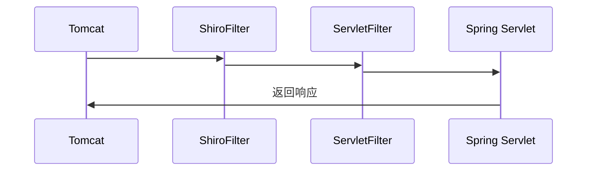
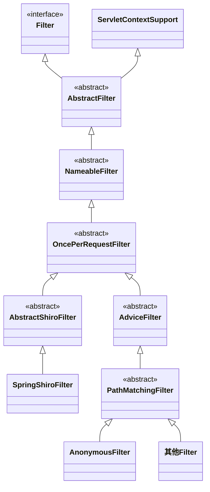
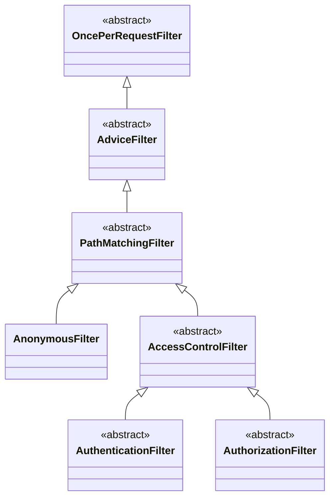
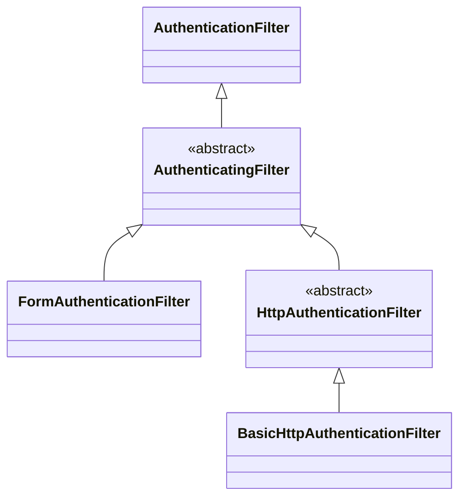

## 前言

shiro 最常见的使用场景就是在 spring web 里面，本篇文章会讲解 shiro 如何集成 spring web 的原理。shiro 会自定义 Filter 嵌入到 servlet 中，当每次请求到来时，会先经过 shiro filter。shiro filter 会解析请求提取出 cookie，然后根据 cookie 完成对此请求的用户身份确认和权限检查，下面会详细介绍整个原理。


## Servlet Filter 原理

我们知道 spring mvc 是基于 servlet 开发的，在 servlet 中有一个比较重要的概念 `Filter`。shiro 集成 spring web 就是依靠`Filter`实现的，下面是集成 shiro 的运行流程图



首先 tomcat 接收到请求，然后经过 ShiroFilter 验证用户身份和权限。再转发给其他`ServletFilter`处理，最后才会交给 Spring 处理。


## Shiro Filter 类图 

Shiro 的 Filter类比较复杂，可以将其分为两类，一种是下图左边的主 Filter，它会被嵌入到`Servlet`里。而右边的 Filter 会只负责一个单独的功能，称作为独立 Filter，被主 Filter 负责管理。




`Filter`接口是 Servlet 中定义的，如果要添加自定义`Filter`必须要实现它。

`AbstractFilter`保存了`Servlet`的相关配置。

`NameableFilter`保存了该`Filter`的名称。

`OncePerRequestFilter`保证了在每次处理 http 请求时，保证该 filter 只会执行一次。 

`AbstractShiroFilter`是最核心的 filter，也比较复杂，下面会着重介绍。

`SpringShiroFilter`只是简单的继承了`AbstractShiroFilter`。

右边的独立 Filter 相关类在后面会有介绍。


## 主 Filter

shrio 只会创建一个主 Filter，嵌入到`Servlet`中。然后其它的独立 Filter 会被添加到主 Filter 里，这种设计可以简化对`Servlet`的修改，并且可以自定义管理多个独立 Filter。主 Filter 会以 Chain 的方式来组织管理，如下图所示。主 Filter 根据请求的路径不同，选择不同的 FilterChain 来处理。


`AbstractShiroFilter`作为实现主 Filter 的核心类，需要详细讲解。它在处理请求时，会先创建`Subject`实例，然后开辟新线程来处理。

```java
public abstract class AbstractShiroFilter extends OncePerRequestFilter {
    
    protected void doFilterInternal(ServletRequest servletRequest, ServletResponse servletResponse, final FilterChain chain) {         
        final ServletRequest request = prepareServletRequest(servletRequest, servletResponse, chain);
        final ServletResponse response = prepareServletResponse(request, servletResponse, chain);
        // 创建Subject，这里会创建WebSubject类型的实例
        final Subject subject = createSubject(request, response);
        subject.execute(new Callable() {
            public Object call() throws Exception {
                updateSessionLastAccessTime(request, response);
                // 执行 filter chain
                executeChain(request, response, chain);
                return null;
            }
        });
    }
}
```

在创建线程的时候，shiro 做了一些初始化，它会绑定当前的`Subject`和`SecurityManager`，存储到线程上下文。结合前期这篇文章，就可以看到线程安全的使用。

继续看看`executeChain`的代码，可以看到 shiro 会有一个根据请求选择`FilterChain`的过程。

```java
public abstract class AbstractShiroFilter extends OncePerRequestFilter {
    
	protected void executeChain(ServletRequest request, ServletResponse response, FilterChain origChain) {
        // 选择对应的FilterChain执行
        FilterChain chain = getExecutionChain(request, response, origChain);
        chain.doFilter(request, response);
    }
}
```


## FilterChain 匹配原理

shiro 支持根据请求来选择对应的`FilterChain`，这个功能由`FilterChainResolver`接口定义。

```java
public interface FilterChainResolver {
    // 根据请求来获取对应的FilterChain
    FilterChain getChain(ServletRequest request, ServletResponse response, FilterChain originalChain);
}
```

它有两个子类，`PathMatchingFilterChainResolver`和`SimpleFilterChainResolver`，都是根据请求路径来判断的。两者的实现没什么本质区别，都是使用`Map`保存了匹配规则和对应的`FilterChain`，只不过前者将路径匹配和`FilterChain`管理分离开了。

### SimpleFilterChainResolver 类

首先来讲讲`SimpleFilterChainResolver`的原理，它非常简单

```java
class SimpleFilterChainResolver implements FilterChainResolver {
    // key 为 匹配路径，value 为 Filter列表。
    private final Map<String, Key<? extends Filter>[]> chains;
    
    public FilterChain getChain(ServletRequest request, ServletResponse response, final FilterChain originalChain) {
        // 提取请求路径
        String path = WebUtils.getPathWithinApplication(WebUtils.toHttp(request));
        // 然后遍历Map，直到找到第一个路径匹配的FilterChain，返回封装后的SimpleFilterChain
        for (final String pathPattern : chains.keySet()) {
            if (patternMatcher.matches(pathPattern, path)) {
                final Iterator<Key<? extends Filter>> chain = Arrays.asList(chains.get(pathPattern)).iterator();
                return new SimpleFilterChain(originalChain, new Iterator<Filter>();
                                             }
                                             }
```


`SimpleFilterChain`包含了两部分的`Filter`，原始的 `Serlvet FilterChain`，和上述`Filter`列表。它被调用时，会先执行`Filter`列表，然后再执行`Serlvet FilterChain`。

```java
class SimpleFilterChain implements FilterChain {
    // Serlvet 的 FilterChain 
    private final FilterChain originalChain;
    
    // Filter 列表
    private final Iterator<? extends Filter> chain;   
}
```


### PathMatchingFilterChainResolver类

`PathMatchingFilterChainResolver`是 shiro 默认的实现类，它只负责匹配的功能，管理`FilterChain`的功能被分离开来了，使得我们可以自由定义`FilterChain`。

管理`FilterChain`的功能由`FilterChainManager`负责，目前只有`DefaultFilterChainManager`一种实现。它的实现也非常简单，我们通过设置`filters`和`filterChains`的值，就可以完成配置。

```java
public class DefaultFilterChainManager implements FilterChainManager {
 
    // 保存所有的Filter，key为filter的名称，value为filter实例
    private Map<String, Filter> filters;
    
    // 保存FilterChain，key为匹配路径，value为NamedFilterList实例，保存了filter列表
    private Map<String, NamedFilterList> filterChains;
    
}
```


## 独立 Filter

我们再来看看独立Filter 的类图，依次从上到下看。

`AdviceFilter`增加了`preHandle`方法，子类可以通过实现它，来控制是否继续执行 `FilterChain`。

`PathMatchingFilter`增加了请求路径匹配的功能。

`AccessControlFilter`作为身份和权限认证的父类，提供了执行失败后的回调函数。





下面的类可以分为三块，

1. `AnonymousFilter`，表示允许匿名访问
2. `AuthenticationFilter`及其子类，表示身份认证方面的
3. `AuthorizationFilter`及其子类，表示权限检查方面的


### 匿名访问 Filter

`AnonymousFilter`允许匿名访问，它复写了`onPreHandle`方法，总是放回 true，表示运行通过。

```java
public class AnonymousFilter extends PathMatchingFilter {

    @Override
    protected boolean onPreHandle(ServletRequest request, ServletResponse response, Object mappedValue) {
        return true;
    }

}
```


### AccessControlFilter 类

`AccessControlFilter`实现了`onPreHandle`方法，并且还定义了`isAccessAllowed`和`onAccessDenied`的方法。子类需要实现`isAccessAllowed`来负责用户身份认证或者权限检查的逻辑。还需要实现`onAccessDenied`方法来执行失败后的处理逻辑。

`AccessControlFilter`会通过两个方法处理的接口，来决定是否要继续执行 filter chain。


### 身份认证 Filter

身份认证的 Filter 类也比较复杂，从上到下依次介绍：

`AuthenticationFilter`实现了`isAccessAllowed`方法，它会判断当前的`Subject` 是否对已经认证过了。

`AuthenticatingFilter`提供了登录的方法。

`FormAuthenticationFilter`提供了表单登录的方法。当用户请求登录地址时（默认为`login.jsp`），它会自动完成登录操作，并且实现跳转页面操作。我们不用再去定义处理登录的 controller。

`BasicHttpAuthenticationFilter`提供了 http basic 验证方法。




我们也可以自定义 Filter，只需要继承`AuthenticationFilter`类，然后实现`onAccessDenied`方法即可。比如我们在实现 restful 风格的 api 时，当发现用户没登录时，只需要返回 json。

```java
public class RestfulFilter extends AuthenticationFilter {
    
    private final String LOGIN_REQUIRED_RESPONSE = "{\"status\": 1, \"msg\": \"login required\"}";
    
    @Override
    protected boolean onAccessDenied(ServletRequest servletRequest, ServletResponse servletResponse) throws Exception {
        HttpServletResponse httpServletResponse = (HttpServletResponse) servletResponse;
        PrintWriter out = servletResponse.getWriter();
        servletResponse.setContentType("application/json;charset=utf-8");
        servletResponse.setCharacterEncoding("UTF-8");
        out.print(LOGIN_REQUIRED_RESPONSE);
        out.flush();

        return false;
    }
}
```


### 权限检查 Filter

权限认证的 Filter 类会相对简单一些，首先看看父类`AuthorizationFilter`。它实现了`onAccessDenied`方法，当权限检查没通过时，会被调用。如果用户没有认证通过的话，`AuthorizationFilter`会返回 302 响应，跳转到登录地址。如果是权限校检没通过，那么会返回 401 响应。

`AuthorizationFilter`还有很多子类，每个子类都会实现各自的权限校检逻辑。下面表列举了各种子类

| 类名                           | 检查逻辑                               |
| ------------------------------ | -------------------------------------- |
| HostFilter                     | 根据用户的ip来判断，是否允许通过       |
| PermissionsAuthorizationFilter | 根据用户的权限来判断，是否允许通过     |
| PortFilter                     | 根据用户的端口号来判断，是否允许通过   |
| HttpMethodPermissionFilter     | 根据用户的请求方法来判断，是否允许通过 |
| RolesAuthorizationFilter       | 根据用户的角色来判断，是否允许通过     |
| SslFilter                      | 用户只有https请求，才会允许通过        |

 


## Filter 创建

`ShiroFilterFactoryBean`负责创建并且始化主 Filter，我们在使用 spring 配置时，都是修改它的参数来完成。下面是它的`createInstance`方法，

```java
public class ShiroFilterFactoryBean implements FactoryBean, BeanPostProcessor {

    protected AbstractShiroFilter createInstance() throws Exception {
        SecurityManager securityManager = getSecurityManager();
        // 创建并且初始化FilterChainManager
        FilterChainManager manager = createFilterChainManager();
        // 创建PathMatchingFilterChainResolver，并且设置FilterChainManager
        PathMatchingFilterChainResolver chainResolver = new PathMatchingFilterChainResolver();
        chainResolver.setFilterChainManager(manager);
        // 返回 SpringShiroFilter 实例
        return new SpringShiroFilter((WebSecurityManager) securityManager, chainResolver);
    }
}
```


上述返回了一个SpringShiroFilter，它非常简单，只是简单的继承了`AbstractShiroFilter`。创建过程中最为核心的部分是`FilterChainManager`的创建，通过设置`filters`和`filterChainDefinitionMap`哈希表，完成配置化。

```java
public class ShiroFilterFactoryBean implements FactoryBean, BeanPostProcessor {
    
    // 用户可以添加自定义的Filter，key为filter的名称，value为filter实例
    private Map<String, Filter> filters;
    
    // 用户可以配置FilterChain，key为chain的名称，value为filter的名称列表，用逗号相连接
    private Map<String, String> filterChainDefinitionMap;
    
    protected FilterChainManager createFilterChainManager() {
        DefaultFilterChainManager manager = new DefaultFilterChainManager();
        // 将用户添加的Filter，保存到FilterChainManager里
        Map<String, Filter> filters = getFilters();
        if (!CollectionUtils.isEmpty(filters)) {
            for (Map.Entry<String, Filter> entry : filters.entrySet()) {
                String name = entry.getKey();
                Filter filter = entry.getValue();
                manager.addFilter(name, filter, false);
            }
        }

        // 将用户添加的chain，保存到FilterChainManager里
        Map<String, String> chains = getFilterChainDefinitionMap();
        if (!CollectionUtils.isEmpty(chains)) {
            for (Map.Entry<String, String> entry : chains.entrySet()) {
                String url = entry.getKey();
                String chainDefinition = entry.getValue();
                manager.createChain(url, chainDefinition);
            }
        }

        return manager;
    }
}
```

