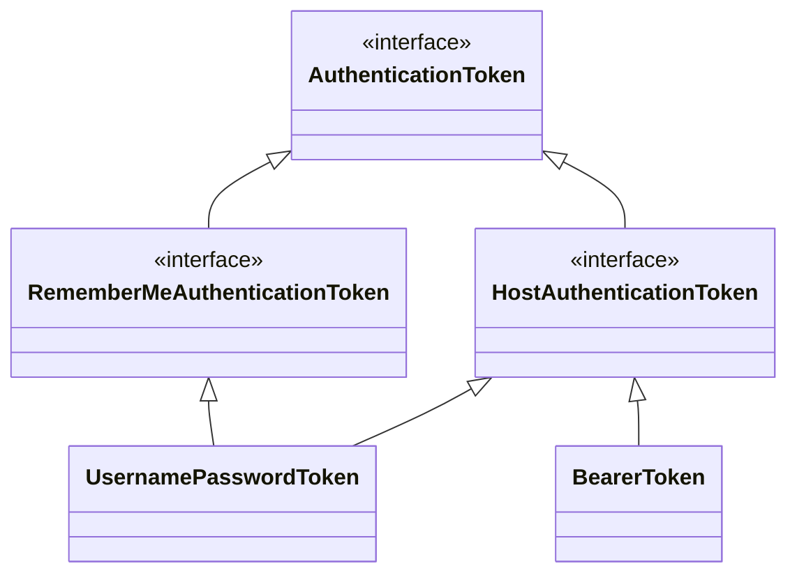
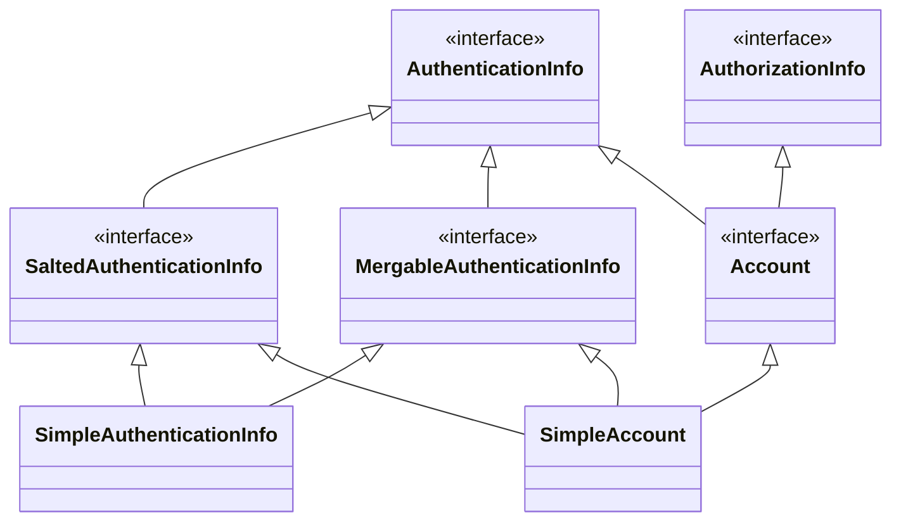
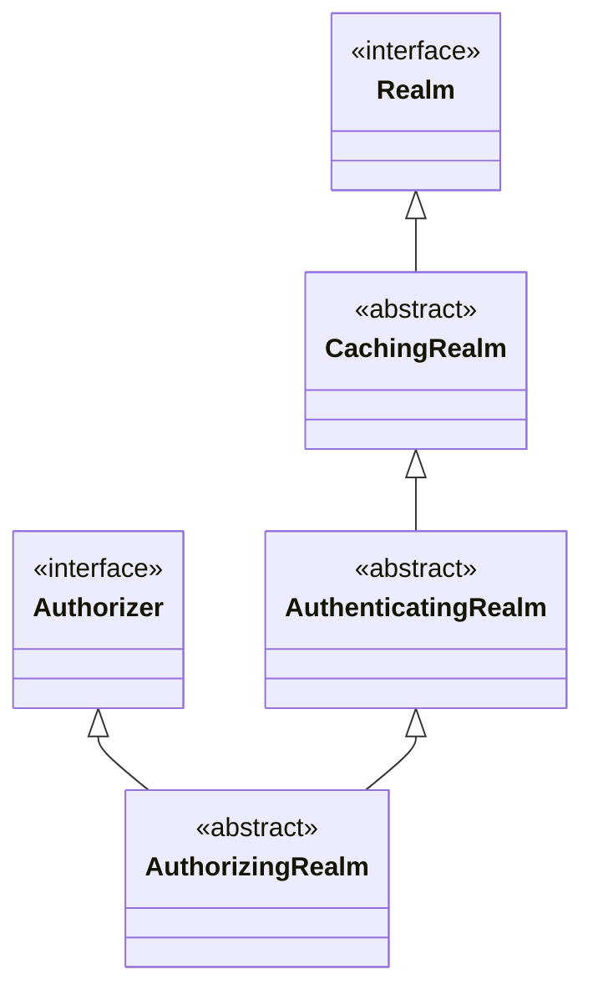
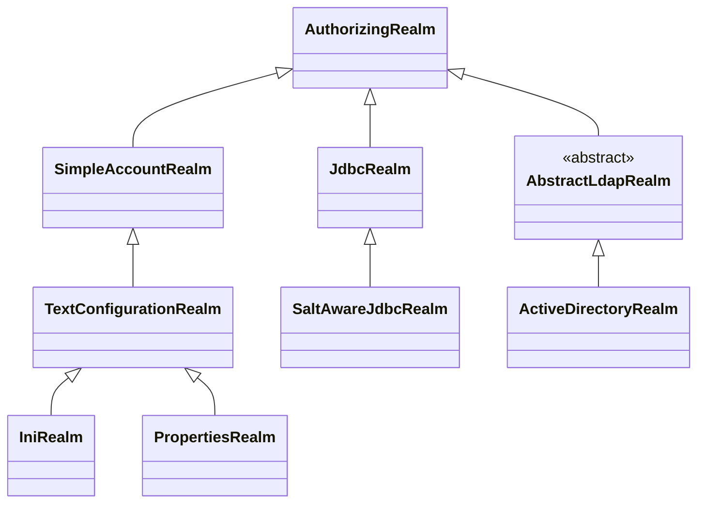

## 前言

在 shiro 框架的文章中，了解到`Realm`是用作获取用户身份信息和权限信息的。shiro 将这块分离出来，使得我们可以自定义，以适应不同的场景。比如用户的信息可以存储数据库中，也在外面添加了一层缓存，我们可以实现自己的`Realm`，完成缓存和数据库的读取操作。


## Realm 接口

先来看看`Realm`接口的定义，它的方法只有三个，涉及到了`AuthenticationToken`和`AuthenticationInfo`两个概念。

```java
public interface Realm {
    // 返回唯一名称，作为该Realm的标识
    String getName();
    
    // 判断是否支持此类认证
    boolean supports(AuthenticationToken token);
    
    // 认证逻辑实现
    AuthenticationInfo getAuthenticationInfo(AuthenticationToken token) throws AuthenticationException;
}
```


## 身份凭证

`AuthenticationToken`是认证的凭证，可以简单的看作是账户名和密码。

```java
public interface AuthenticationToken extends Serializable {
    
    // 用户的唯一标识，相当于账户名
    Object getPrincipal();

    // 用户的凭证，相当于密码 
    Object getCredentials();
}
```


下面是`AuthenticationToken`相关接口的类图




`HostAuthenticationToken`添加了客户端的ip接口，`RememberMeAuthenticationToken`添加了是否需要记住我的接口。我们接着需要看看子类的实现，`UsernamePasswordToken`和`BearerToken`。

`UsernamePasswordToken`是用于账户名和密码的验证方式，所以它会保存这两个属性，当作`Principal`和`Credentials`。

```java
public class UsernamePasswordToken {
    
    private String username;
    
    private char[] password;
   
    // 返回账户名
    public Object getPrincipal() {
        return getUsername();
    }
    
    // 返回密码
    public Object getCredentials() {
        return getPassword();
    }
}
    
```


`BearerToken`是用于基于 token 的验证方式，所以它的`Principal`和`Credentials`都是 token。当使用 jwt 验证时，就可以使用`BearerToken`。

```java
public class BearerToken {
    
    private final String token;
    
    // 返回 token
    public Object getPrincipal() {
        return token;
    }

    // 返回 token
    public Object getCredentials() {
        return token;
    }
}
```


## 身份认证结果

`AuthenticationInfo`表示身份认证后的结果，包含了用户的身份信息。需要注意下`getPrincipals`返回的是身份集合，因为当存在多个`Realm`时，一个账户有可能是有多个身份的。

```java
public interface AuthenticationInfo extends Serializable {
    
    // 返回认证后的身份集合
    PrincipalCollection getPrincipals();
    
    // 返回凭证
    Object getCredentials();
}
```

`AuthenticationInfo`的相关类图如下所示，注意到右上边的`AuthorizationInfo`接口，它包含了用户的权限。



`SaltedAuthenticationInfo`支持加盐操作，`MergableAuthenticationInfo`支持合并用户身份信息。

`SimpleAuthenticationInfo`也只是简单的实现，保存了对应的属性。

`SimpleAccount`实现了`AuthenticationInfo`接口，保存了身份信息，也实现了`AuthorizationInfo`接口，保存了用户的权限。


## Realm 子类

现在可以回过来看看 Realm 的子类，首先来看看它的类图




`CachingRealm`提供了缓存管理，在后续子类中会用到。

`AuthenticatingRealm`实现了身份认证。

`AuthorizingRealm`实现了权限检查。

由于`CachingRealm`类比较简单，这里就不做详细介绍了，对于`AuthenticatingRealm`和`AuthorizingRealm`需要详细介绍。

我们先来仔细看看`AuthenticatingRealm`的原理，它负责返回用户的身份信息，并且会将结果缓存。

```java
public abstract class AuthenticatingRealm extends CachingRealm implements Initializable {
    
    // 表示这个Realm所能处理的 token 类型
    private Class<? extends AuthenticationToken> authenticationTokenClass;
    
    public boolean supports(AuthenticationToken token) {
        return token != null && getAuthenticationTokenClass().isAssignableFrom(token.getClass());
    }
    
    public final AuthenticationInfo getAuthenticationInfo(AuthenticationToken token) throws AuthenticationException {
        // 先从缓存里查找对应的身份信息
        AuthenticationInfo info = getCachedAuthenticationInfo(token);
        if (info == null) {
            // 如果缓存没有，则需要调用doGetAuthenticationInfo方法执行身份验证
            // 子类需要实现此方法
            info = doGetAuthenticationInfo(token);
            if (token != null && info != null) {
                // 将结果存到缓存
                cacheAuthenticationInfoIfPossible(token, info);
            }
        }
        if (info != null) {
            // 验证token是否和身份信息info一致
            assertCredentialsMatch(token, info);
        }
        return info;
    }
}
```


继续看`AuthorizingRealm`的原理，它实现了`Authorizer`接口，负责返回用户的权限，并且也缓存结果。

```java
public abstract class AuthorizingRealm extends AuthenticatingRealm implements Authorizer {
    
    protected AuthorizationInfo getAuthorizationInfo(PrincipalCollection principals) {
        AuthorizationInfo info = null;
        // 先从缓存中查询用户权限
        Cache<Object, AuthorizationInfo> cache = getAvailableAuthorizationCache();
        Object key = getAuthorizationCacheKey(principals);
        info = cache.get(key);

        if (info == null) {
            // 如果缓存中没有找到，则调用doGetAuthorizationInfo方法获取，
            // 子类需要实现此方法
            info = doGetAuthorizationInfo(principals);
            if (info != null && cache != null) {
                Object key = getAuthorizationCacheKey(principals);
                cache.put(key, info);
            }
        }
        return info;
    }
}
```


## 系统自带 Realm

shrio 已经实现了多个 Realm 的子类，如下图所示。



这些子类按照使用场景分为三类，左边以`SimpleAccountRealm`为父类的，表示用户信息都存储到内存里。`TextConfigurationRealm`表示从文件中加载信息到内存，它的子类`IniRealm`表示读取`ini`格式的配置文件，`PropertiesRealm`表示读取`properties`格式的配置文件。

中间以`JdbcRealm`为父类的，表示用户信息存储在数据库中。它的子类`SaltAwareJdbcRealm`在其基础之上，增加了盐，可以看作是一种加密手段。

右边以`AbstractLdapRealm`为父类的，表示用户信息存储在`ldap`服务中。`ActiveDirectoryRealm`表示采用了`ActiveDirectory`服务，它是`ldap`实现的一种。


## 自定义 Realm

上面介绍了`Realm`的设计思想，这里会介绍我们该如何使用`Realm`。我们在自定义`Realm`时，只需要继承`AuthorizingRealm`，然后实现它的两个方法即可。

```java
class AuthorizingRealm {
    
    // 进行身份验证，返回身份信息
    protected AuthenticationInfo doGetAuthenticationInfo(AuthenticationToken token) throws AuthenticationException;
    
    // 返回用户的权限
    protected abstract AuthorizationInfo doGetAuthorizationInfo(PrincipalCollection principals);
}
```


这里写个简单的例子，只允许`admin`用户登录，它只有`read`权限。

```java
class MyRealm extends AuthorizingRealm {
    
    protected AuthenticationInfo doGetAuthenticationInfo(AuthenticationToken token) throws AuthenticationException {
        
    	String username = token.;
        String password = token.;
        if(username.equals("admin") && username.equals("admin")) {
            return new SimpleAuthenticationInfo(username, password, "myrealm");
        }
        // 如果认证失败，则抛出异常
        throw new AuthenticationException();
    }
    
    protected AuthorizationInfo doGetAuthorizationInfo(PrincipalCollection principals) {
        String username = (String) principalCollection.getPrimaryPrincipal();
        SimpleAuthorizationInfo info = new SimpleAuthorizationInfo();
        if (username.equals("admin")) {
			info.addStringPermission("read");            
        }
        return info;
    }
    
}
```


