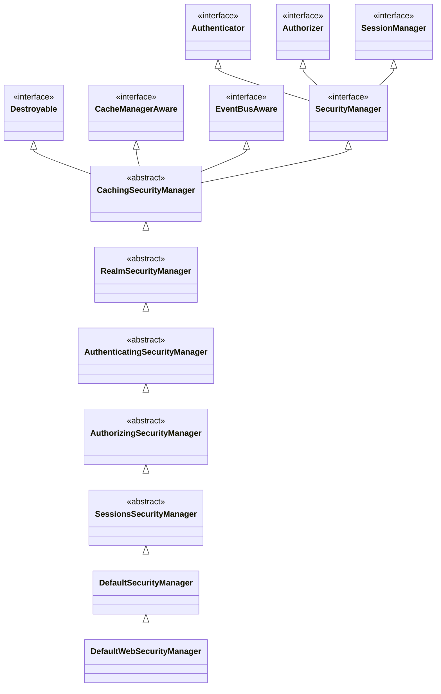
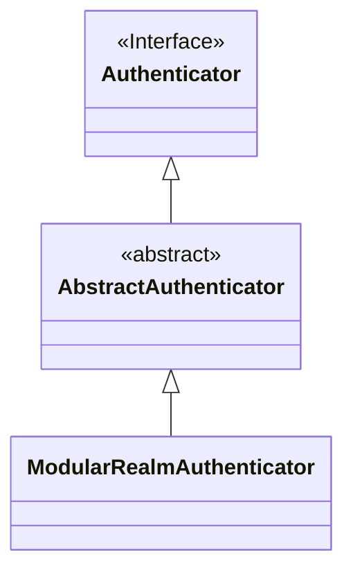

## 前言

从前篇 shiro 架构文章中，可以了解到 SecurityManager 是 shrio 框架中最核心的部分，它作连接了认证，权限，session 多个模块。本篇文章会介绍 SecurityManager 的设计思想，和多个模块之间的衔接。


## 设计模式

SecurityManager 的设计使用了门面模式，如下图所示：


SecurityManager  作为门面类，封装下面的多个子模块。


## SecurityManager  类图

再来看看它的类图设计：




上图虽然涉及到了多个类，层级比较多，但是它的设计思想不难。首先注意到最上层的`SecurityManager`接口，它继承了三个接口，

1. `Authenticator`，身份认证
2. `Authorizer`，权限认证
3. `SessionManager`，session 管理

然后继续看下面的子类，每一个子类都实现了特定的接口。

1. `AuthenticatingSecurityManager`层实现了`Authenticator`接口，支持用户身份认证。
2. `AuthorizingSecurityManager`层实现了`Authorizer`接口，支持权限验证。
3. `SessionsSecurityManager`层实现了`SessionManager`接口，支持 session，注意到这里session不仅仅包含web的session。

这三个类都是用了策略模式，来实现对应的接口。以`AuthenticatingSecurityManager`为例，它实现了`Authenticator`接口，但都是转发给别的`Authenticator`实例完成，如下图所示


下面是`AuthenticatingSecurityManager`实现的代码

```java
public abstract class AuthenticatingSecurityManager extends RealmSecurityManager {
    
    private Authenticator authenticator;
    
    public AuthenticationInfo authenticate(AuthenticationToken token) throws AuthenticationException {
        // 调用了其它Authenticator的方法
        return this.authenticator.authenticate(token);
    }
}
```


`DefaultSecurityManager`是 shiro 默认的实现类。

`DefaultWebSecurityManager`用于在 Web 环境下，增加了 http 的操作。


## 身份认证模块

身份认证作为 shiro 最基础的模块，这里需要讲述下它的原理和如何集成到 SecurityManager。

###  Authenticator 接口

认证接口由`Authenticator`接口表示

```java
public interface Authenticator {
    
    // authenticationToken 包含了验证信息，
    // 如果验证失败，会抛出异常。如果验证成功，则会返回用户身份信息 AuthenticationInfo
    public AuthenticationInfo authenticate(AuthenticationToken authenticationToken)
            throws AuthenticationException;
}
```


`Authenticator`也有多个子类：



`AbstractAuthenticator`抽象类，支持认证成功和失败时的回调。这里需要重要的介绍下`ModularRealmAuthenticator`子类，它作为 shrio 默认的实现类，并且负责连接着`DefaultSecurityManager`和`Realm`。

`ModularRealmAuthenticator`有个重要的功能，能支持不同的认证策略。举个例子，小明既是公司A的技术总监，同时也是公司B的技术总监，并且两个公司有着独立的身份认证。

现在小明登录到一个系统，这个系统要求只要是技术总监身份，就可以登录，那么认证策略为至少一次认证成功。

如果该系统要求必须是两个公司的技术总监身份，才能登录，那么认证策略为全部都要成功。


shrio 目前支持的策略如下所示：

| 认证策略类                     | 含义                                                     |      |
| ------------------------------ | -------------------------------------------------------- | ---- |
| `AtLeastOneSuccessfulStrategy` | 会进行所有的身份认证，并聚集认证结果（默认策略）         |      |
| `AllSuccessfulStrategy`        | 必须全部认证成功                                         |      |
| `FirstSuccessfulStrategy`      | 只使用第一个身份认证成功的结果，并且支持自定义退出认证链 |      |


继续来看看`ModularRealmAuthenticator`的内部，它管理者多个身份认证，这个就是`Realm`接口，在后面会介绍。下面的代码可以看到它有一个列表来保存`Realm`

```java
public class ModularRealmAuthenticator extends AbstractAuthenticator {
    // 身份认证，用户可以自己实现
    private Collection<Realm> realms;
    
    // 认证策略
    private AuthenticationStrategy authenticationStrategy;
}
```


### 集成 Authenticator 

我们再回到`SecurityManager`，看看它是如何与`ModularRealmAuthenticator`集成的。这里通过查看`SecurityManager`的两个子类就可以知道。

首先`RealmSecurityManager`支持设置`Realm`列表，注意到`afterRealmsSet`函数的调用。

```java
public abstract class RealmSecurityManager extends CachingSecurityManager {
    
    private Collection<Realm> realms;
    
    public void setRealms(Collection<Realm> realms) {
        this.realms = realms;
        afterRealmsSet();
    }
}
```

然后看看`AuthenticatingSecurityManager`的实现

```java
public abstract class AuthenticatingSecurityManager extends RealmSecurityManager {
    
    private Authenticator authenticator;
    
    public AuthenticatingSecurityManager() {
        super();
        // 实例化ModularRealmAuthenticator
        this.authenticator = new ModularRealmAuthenticator();
    }
    
    // 重载afterRealmsSet函数
    protected void afterRealmsSet() {
        super.afterRealmsSet();
        if (this.authenticator instanceof ModularRealmAuthenticator) {
            // 将 Realm列表存储到 ModularRealmAuthenticator
            ((ModularRealmAuthenticator) this.authenticator).setRealms(getRealms());
        }
    }
}
```


## 权限校检

权限校检同样作为 shiro 最基础的模块，这里也需要讲述下它的原理和如何集成到 SecurityManager。

### Authorizer 接口

权限校检接口由`Authorizer`接口表示，下面列举它的一些方法

```java
public interface Authorizer {
    
    boolean isPermitted(PrincipalCollection principals, String permission);
    
    boolean isPermitted(PrincipalCollection subjectPrincipal, Permission permission);
}
```


`Authorizer`也有一个很重要的子类`ModularRealmAuthorizer`，作为 shrio 默认的实现类，同样管理着多个权限校检。

```java
public class ModularRealmAuthorizer implements Authorizer {
    
    // Realm 列表
    protected Collection<Realm> realms;

    // 循环遍历Realm，如果其中有一个权限校检成功，那么就会认为权限通过
    public boolean isPermitted(PrincipalCollection principals, String permission) {
        for (Realm realm : getRealms()) {
            if (!(realm instanceof Authorizer)) continue;
            if (((Authorizer) realm).isPermitted(principals, permission)) {
                return true;
            }
        }
        return false;
    }
}
```

注意到上述的权限校检，这里同身份认证不同，只支持一种策略，那就是只要匹配其中的一个权限校检，就认为权限校检成功。

### 集成 SecurityManager

我们来看看它与`SecurityManager`集成原理，是由`AuthorizingSecurityManager`类负责的。

```java
public abstract class AuthorizingSecurityManager extends AuthenticatingSecurityManager {
    
    private Authorizer authorizer;
    
    public AuthorizingSecurityManager() {
        super();
        // 实例化ModularRealmAuthorizer
        this.authorizer = new ModularRealmAuthorizer();
    }
    
    // 重载afterRealmsSet方法
    protected void afterRealmsSet() {
        super.afterRealmsSet();
        if (this.authorizer instanceof ModularRealmAuthorizer) {
            // 设置 ModularRealmAuthorizer 的 Realm 列表
            ((ModularRealmAuthorizer) this.authorizer).setRealms(getRealms());
        }
    }
    
    public boolean isPermitted(PrincipalCollection principals, String permissionString) {
        // 权限校检直接交给authorizer处理
        return this.authorizer.isPermitted(principals, permissionString);
    }
    
    //...... 其余的权限校检接口的实现，都是转发给authorizer处理
}
```

