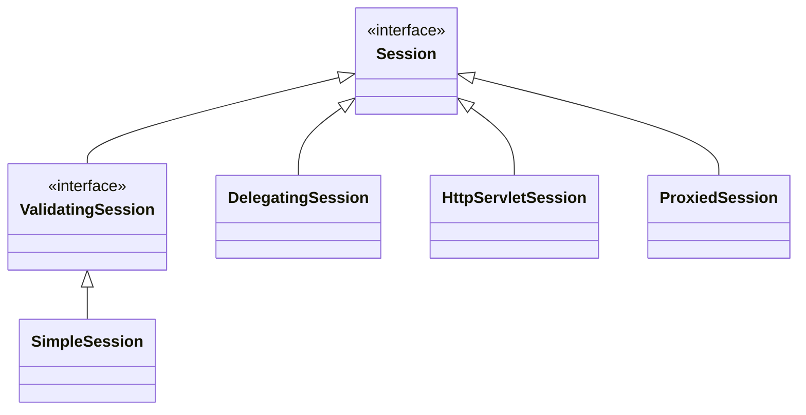
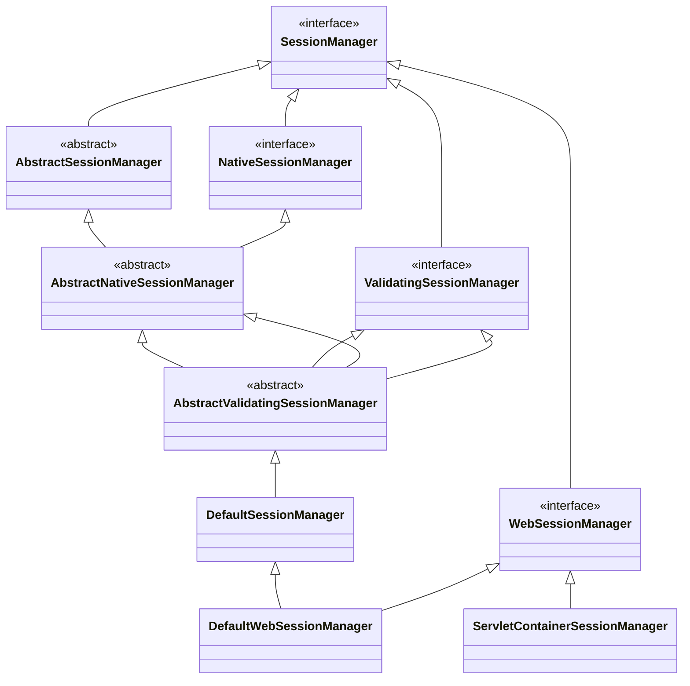
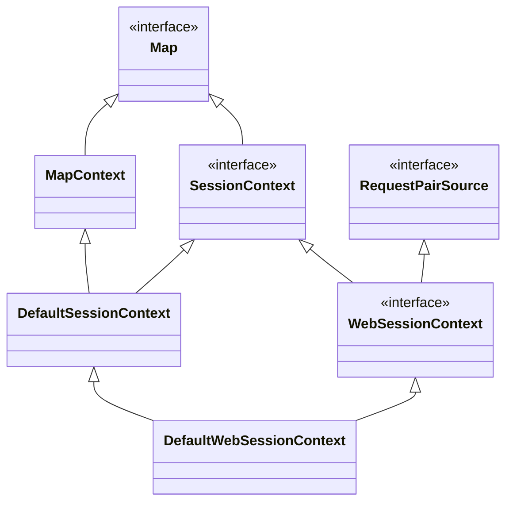
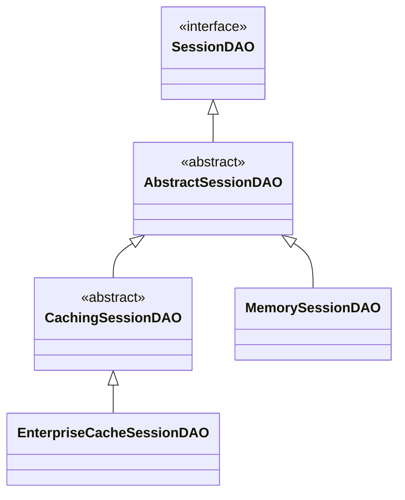
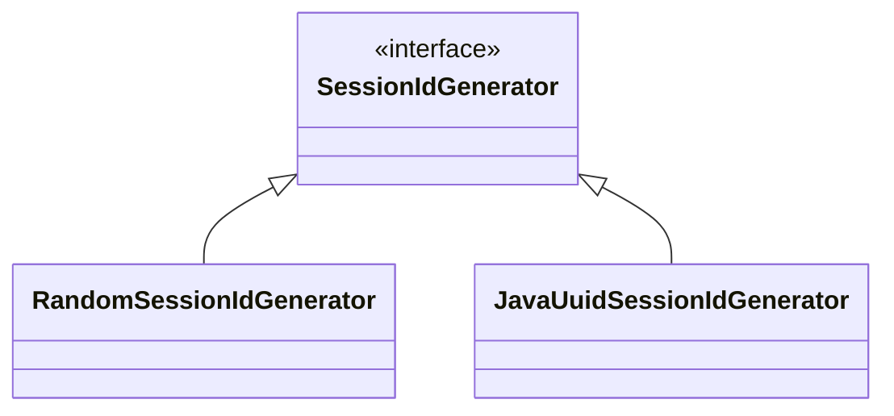

## 前言

shiro 提供了 session 用于保存与用户相关的信息，需要注意到这和 HTTP 的 session 概念是不一样的，它可以运行在没有web环境下。本篇文章会先介绍 Web 环境下的原理，读者有兴趣的话，可以看看在非 Web 环境下的原理。


## Session 接口



`Session` 定义了主要接口，支持设置时间有效期，存储等。

```java
public interface Session {
    
    // 返回 sessionId
	Serializable getId();
    
    // 设置超时时间
    void setTimeout(long maxIdleTimeInMillis) throws InvalidSessionException;
    
    // 添加值
    void setAttribute(Object key, Object value) throws InvalidSessionException;
    
    Object getAttribute(Object key) throws InvalidSessionException;
    
	// ....
}
```


`HttpServletSession` 实现了 http 的 session，运行在 web 环境。

`DelegatingSession`支持本地管理 session，运行在非 web 环境。

`ProxiedSession`只是`Session`的代理类。

`SimpleSession`只是简单的`Session`实现类。


## Session 管理

session 管理分为两类，非 Web 环境和 Web 环境。它负责 session 的创建，查找，删除等管理操作，由`SessionManager`接口表示。

### SessionManager 接口

`SessionManager`只有两个方法，创建和查找 session。通过这两个方法的声明，可以看到多个概念的联系。

```java
public interface SessionManager {
    
    // 创建Session实例
    Session start(SessionContext context);
    
    // 获取Session实例
    Session getSession(SessionKey key) throws SessionException;
}
```

上述方法涉及到了 `Session`，`SessionContext`，`SessionKey`和`SessionManager`四种概念，这里先简单介绍下它们，

* `Session`存储了用户的相关信息
* `SessionContext`用作初始化`Session`实例
* `SessionKey`是`Session`实例的 id，用于查找
* `SessionManager`管理着多个`Session`


### SessionManager 类图

session 管理根据使用环境分为 HTTP 和 非 HTTP 两类。下图中左边的部分是使用本地 session 管理，在 Web 环境和非 Web 环境下都可以试用。右边的是使用`Servlet`自带的 session 管理，只能在 Web 环境下使用。





`NativeSessionManager`定义了本地 session 管理的接口，也就是说它可以存在非 web 环境下。

`DefaultSessionManager`是用于非 Web 环境下， 默认的管理器。

`DefaultWebSessionManager`是 shrio 支持用于 Web 环境下，只不过使用了自己的 session 管理。

`ServletContainerSessionManager`是基于 spring web 实现的，只能用于 Web 环境下，它只是简单的封装了`Serlvet`相关功能。


### Web 环境

因为 Web 的场景会非常普遍，而且实现也比较简单，所以会先讲解这部分。`ServletContainerSessionManager`类实现了`SessionManager`接口，下面是它的代码

```java
public class ServletContainerSessionManager implements WebSessionManager {
    
    // 实现start接口，创建Session实例
    public Session start(SessionContext context) throws AuthorizationException {
        return createSession(context);
    }
    
    protected Session createSession(SessionContext sessionContext) throws AuthorizationException {
        // 这里sessionContext实际是DefaultWebSessionContext类型，从中提取HttpServletRequest
        HttpServletRequest request = WebUtils.getHttpRequest(sessionContext);
		// 从中提取HttpSession
        HttpSession httpSession = request.getSession();

        // 构建HttpServletSession实例
        String host = getHost(sessionContext);
        return createSession(httpSession, host);
    }
    
    protected Session createSession(HttpSession httpSession, String host) {
        return new HttpServletSession(httpSession, host);
    }
    
    // 获取 session
    public Session getSession(SessionKey key) throws SessionException {
        HttpServletRequest request = WebUtils.getHttpRequest(key);
        Session session = null;
        // 从HttpServletRequest获取session
        HttpSession httpSession = request.getSession(false);
        if (httpSession != null) {
            session = createSession(httpSession, request.getRemoteHost());
        }

        return session;
    }
    
}
```


 可以看到，它只是简单的调用了`HttpServletRequest`相关的方法，创建了`HttpServletSession`实例。`HttpServletSession`也只是简单的包装了一下`HTTPSession`。

```java
public class HttpServletSession implements Session {
    
    private HttpSession httpSession = null;
    
    // 返回 session id
    public Serializable getId() {
        return httpSession.getId();
    }
    
    // 获取session里的值
    public Object getAttribute(Object key) throws InvalidSessionException {
        return httpSession.getAttribute(assertString(key));
    }
    
    // 设置session里的值
    public void setAttribute(Object key, Object value) throws InvalidSessionException {
        httpSession.setAttribute(assertString(key), value);
    }
}
```


### 非 Web 环境

`DefaultSessionManager`是非 Web 环境下默认的 session 管理器。我们来看看它的实现原理，因为它继承了`AbstractNativeSessionManager`类，所以真正的创建 session 实例由`doCreateSession`方法负责。从下面的代码可以看到，session的创建是有工厂类`SessionFactory`负责，并且创建后还会将其持久化。

```java
public class DefaultSessionManager extends AbstractValidatingSessionManager {
    
    // 负责实例化 session
    private SessionFactory sessionFactory;
    
    // session 持久化
    protected SessionDAO sessionDAO;
    
 	protected Session doCreateSession(SessionContext context) {
        // 使用SessionFactory创建实例
        Session s = newSessionInstance(context);
        // 使用SessionDAO持久化
        create(s);
        return s;
    }
    
    protected Session newSessionInstance(SessionContext context) {
        return getSessionFactory().createSession(context);
    }
    
     protected void create(Session session) {
        sessionDAO.create(session);
    }
}
```


同样根据 sessionId 查找 session 的方法，最终由`retrieveSession`实现。可以看到session的查找最终是由`SessionDAO`负责。

```java
public class DefaultSessionManager extends AbstractValidatingSessionManager {
    
    protected Session retrieveSession(SessionKey sessionKey) throws UnknownSessionException {
        Serializable sessionId = getSessionId(sessionKey);
        // 调用SessionDAO来寻找session
        Session s = retrieveSessionFromDataSource(sessionId);
        return s;
    }
    
    protected Session retrieveSessionFromDataSource(Serializable sessionId) throws UnknownSessionException {
        return sessionDAO.readSession(sessionId);
    }
}
```


## Session 实例化

上面涉及到了`SessionFactory`工厂类，用作创建 session。接下来就讲讲它的原理。


### SessionFactory 工厂类

`SessionFactory`接口定义了创建 Session 的方法`createSession`，其中参数`SessionContext`是用作初始化的。

```java
public interface SessionFactory {
    Session createSession(SessionContext initData);
}
```

目前只有`SimpleSessionFactory`类实现了该接口，它的实现非常简单

```java
public class SimpleSessionFactory implements SessionFactory {

    // 这里只是存储了客户端的host
    public Session createSession(SessionContext initData) {
        if (initData != null) {
            String host = initData.getHost();
            if (host != null) {
                return new SimpleSession(host);
            }
        }
        return new SimpleSession();
    }
}
```


### 初始化参数`SessionContext`

`SessionContext`的相关类图如下所示，虽然比较多，但是原理很简单。




`SessionContext`继承 `Map`接口，并且定义了 host 和 sessionId 两个属性的操作方法。

```java
public interface SessionContext extends Map<String, Object> {
    
    void setHost(String host);
    
    String getHost();
    
    Serializable getSessionId();
    
    void setSessionId(Serializable sessionId);
}
```


`DefaultSessionContext`实现了默认的`SessionContext`接口。

`DefaultWebSessionContext`在它基础之上，添加了获取`ServletRequest`和`ServletResponse`实例的方法。


## Session 持久化

`SessionDAO`定义了 session 增删改查接口，如下所示：

```java
public interface SessionDAO {
    
    Serializable create(Session session);

    Session readSession(Serializable sessionId) throws UnknownSessionException;

    void update(Session session) throws UnknownSessionException;

    void delete(Session session);

    Collection<Session> getActiveSessions();
}
```

它的子类图如下所示：



`AbstractSessionDAO`实现了`SessionDAO`接口，并且定义了`doCreate`接口，子类需要实现它并且返回 `SessionId`。

`MemorySessionDAO`使用了 `ConcurrentMap`来保存 session。

`CachingSessionDAO`实现了session缓存，用户可以集成`CacheManager`实现自定义的缓存。


当持久化化 session 的时候，`SessionDAO`会使用`SessionIdGenerator`接口生成唯一的 `SessionId`。




`RandomSessionIdGenerator`会生成随机的 sessionId，`JavaUuidSessionIdGenerator`会生成 uuid。


## Session 集成

我们再回到`DefaultSecurityManager`类，看看它是如何集成`Session`的。`SessionsSecurityManager`是它的父类，它默认使用`DefaultSessionManager`实现，实现了 session 管理。

```java
public abstract class SessionsSecurityManager extends AuthorizingSecurityManager {
    
    private SessionManager sessionManager;
    
    // 使用DefaultSessionManager作为默认的实现
    public SessionsSecurityManager() {
        super();
        this.sessionManager = new DefaultSessionManager();
    }
    
    // 转发给sessionManager处理
    public Session start(SessionContext context) throws AuthorizationException {
        return this.sessionManager.start(context);
    }

    // 转发给sessionManager处理
    public Session getSession(SessionKey key) throws SessionException {
        return this.sessionManager.getSession(key);
    }
}
```


