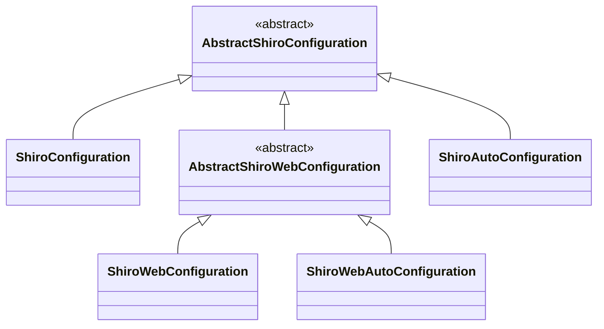

## 前言

shiro 框架支持多种使用场景，并且都提供了默认配置，本篇文章会介绍 shiro 的配置原理和如何与 springboot 集成的。


## 默认配置类

shiro 支持运行在 Web 环境下和非 Web 环境下，每种环境都有着不一样的默认配置。

### 非 Web 环境

`AbstractShiroConfiguration`提供了非 Web 环境下的的默认配置。它提供了`securityManager`方法来创建`SecurityManager`实例，

```java
public class AbstractShiroConfiguration {
    
    protected SessionsSecurityManager securityManager(List<Realm> realms) {
        // 使用createSecurityManager创建securityManager
        SessionsSecurityManager securityManager = createSecurityManager();
        // 进行securityManager的配置
        securityManager.setAuthenticator(authenticator());
        securityManager.setAuthorizer(authorizer());
        securityManager.setRealms(realms);
        securityManager.setSessionManager(sessionManager());
        securityManager.setEventBus(eventBus);

        if (cacheManager != null) {
            securityManager.setCacheManager(cacheManager);
        }

        return securityManager;
    }
}
```


可以看到它在创建`SecurityManager`时，使用了很多配置参数，这些参数都是以函数的方式返回，比如`authenticator`函数返回`Authenticator`实例。这样设计使得子类就可以复写该方法，实现自定义参数配置，并且方法名和参数类型名称是相同的，这样刚好符合 spring bean 的配置规范。

下面是`AbstractShiroConfiguration`提供的默认参数表，只是列举了一些重要的参数，

| 方法名                | 返回类型                  | 含义                                        |
| --------------------- | ------------------------- | ------------------------------------------- |
| createSecurityManager | DefaultSecurityManager    | SecurityManager 实例，作为shiro的核心门面类 |
| authenticator         | ModularRealmAuthenticator | Authenticator 实例，作为用户身份认证        |
| authorizer            | ModularRealmAuthorizer    | Authorizer 实例，作为用户权限检查           |
| sessionManager        | DefaultSessionManager     | SessionManager 实例，作为 session 管理      |


### Web 环境下

`AbstractShiroWebConfiguration`作为web 场景下的默认配置，它集成了`AbstractShiroConfiguration`，复写了一些参数的方法。下面是它的默认参数表

| 方法名                | 返回类型                       | 含义                                        |
| --------------------- | ------------------------------ | ------------------------------------------- |
| createSecurityManager | DefaultWebSecurityManager      | SecurityManager 实例，作为shiro的核心门面类 |
| sessionManager        | ServletContainerSessionManager | SessionManager 实例，作为 session 管理      |


## shiro 配置类





上面已经讲解了`AbstractShiroConfiguration`和`AbstractShiroWebConfiguration`两个抽象类的原理，图中其他的类都对应了不同的使用场景。

| 配置类                    | 集成框架    | 使用环境    |
| ------------------------- | ----------- | ----------- |
| ShiroConfiguration        | spring      | 非 Web 环境 |
| ShiroWebConfiguration     | spring      | Web 环境    |
| ShiroAutoConfiguration    | spring boot | 非 Web 环境 |
| ShiroWebAutoConfiguration | spring boot | Web 环境    |


这些类都添加了`@Configuration`注解，并且参数方法也都提供了`@Bean` 注解，这样方便集成 spring。下面只会讲解 springboot web 环境下的配置原理，这种场景使用最为常见。


## SpringBoot web 集成示例

虽然网上关于 spring boot 集成 shiro 的配置教程很多，但是个人觉得都不够简洁，并没有理解到 shiro 的设计思想，所以这里单独拿出来讲一下。

### 在 pom.xml 添加 shiro-spring 依赖

```xml
<dependency>
    <groupId>org.apache.shiro</groupId>
    <artifactId>shiro-spring-boot-web-starter</artifactId>
    <version>1.5.2</version>
</dependency>
```


### 自定 Realm

自定义Realm，负责提供身份信息和权限信息。下面假设`AccountService`类实现了用户相关的方法。

```java
public class MyRealm extends AuthorizingRealm {

    @Autowired
    AccountService service;

    @Override
    protected AuthorizationInfo doGetAuthorizationInfo(PrincipalCollection principalCollection) {
        String username = principalCollection.getPrimaryToken();
        return service.getPermission(username);
    }

    @Override
    protected AuthenticationInfo doGetAuthenticationInfo(AuthenticationToken authenticationToken) throws AuthenticationException {
        UsernamePasswordToken token = (UsernamePasswordToken) authenticationToken;
        String username = token.getUsername();
        String password = String.valueOf(token.getPassword());
        if (!service.checkUserPassword(username, password)) {
            throw new AuthenticationException();
        }
        SimpleAuthenticationInfo info = new SimpleAuthenticationInfo(username, password, "my_realm");
        return info;
    }

}
```


### 自定义  Filter

这里自定义 Filter 是为了实现 Restful 风格的接口，当发现用户没有登录，就会返回 json 数据，status 为 1 的错误码。

```java
public class RestFilter extends AuthenticationFilter {

    public final String LOGIN_REQUIRED_RESPONSE = "{\"status\" : 1}";

    @Override
    protected boolean onAccessDenied(ServletRequest servletRequest, ServletResponse servletResponse) throws Exception {
        PrintWriter out = servletResponse.getWriter();
        servletResponse.setContentType("application/json;charset=utf-8");
        servletResponse.setCharacterEncoding("UTF-8");
        out.print(LOGIN_REQUIRED_RESPONSE);
        out.flush();

        return false;
    }

}
```


### 配置类

现在来到了最核心的配置，首先返回了自定义 Realm 和 Filter。需要注意下 Filter，这里单独配置了它不会被注册到 Serlvet 里。因为我们自定义的 filter 只能由 shiro 的 主 filter 管理，所以不能注册到 Serlvet，在这篇文章有详细介绍到，  。

还有需要定义`ShiroFilterChainDefinition`，这里配置了根据请求路径，来选择哪条 FilterChain。比如`login`路径的请求，会被只包含`anon`的 FilterChain 处理，表示匿名用户都能访问。其余路径的请求，则由包含`RestFilter`的 FilterChain 处理。

```java
@Configuration
public class ShiroConfig {

    @Bean
    public Realm realm() {
        return new MyRealm();
    }

    @Bean
    public RestFilter myauth() {
        return new RestFilter();
    }

    @Bean
    public FilterRegistrationBean restFilterRegistration(RestFilter filter) {
        FilterRegistrationBean registration = new FilterRegistrationBean(filter);
        registration.setEnabled(false);
        return registration;
    }


    @Bean
    public ShiroFilterChainDefinition shiroFilterChainDefinition() {
        DefaultShiroFilterChainDefinition chainDefinition = new DefaultShiroFilterChainDefinition();
        chainDefinition.addPathDefinition("/login", "anon");
        chainDefinition.addPathDefinition("/**", "myauth");
        return chainDefinition;
    }

}
```


### 添加 controller 示例

这里写个简单的controller，实现登录和访问页面的接口。比如访问`/hello`路径，则该请求需要先通过身份认证，才能访问，否则会返回`{"status": 1}`的响应。

```java
@RestController
public class AccountController {
    
    @PostMapping(value = "/login")
    public Response login(@RequestBody LoginRequest request, HttpServletResponse response) {
        Subject user = SecurityUtils.getSubject();
        UsernamePasswordToken token = new UsernamePasswordToken(request.getUsername(), request.getPassword());
        try {
            user.login(token);
        } catch (AuthenticationException errro) {
            return Response.PASSWORD_FAIL_RESPONSE;
        }

        return Response.OK_RESPONSE;
    }
    
    @GetMapping(path = "/hello")
    public Response get() {
        Response result = new Response();
        result.setCode(0);
        result.setData("hello");
        return result;
    }
}
```


## springboot shiro 集成原理

当我们引入了`shiro-spring-boot-web-starter`模块后，springboot 会根据该模块的配置，自动引入`ShiroWebAutoConfiguration`和`ShiroWebFilterConfiguration`配置。

### Filter 配置

`ShiroWebFilterConfiguration`是用来配置 shiro Filter。可以看到它使用了很多条件注解，并且可以看到它使用`FilterRegistrationBean`注册了 shiro 主 Filter。

```java
@Configuration
@ConditionalOnProperty(
    name = {"shiro.web.enabled"},
    matchIfMissing = true
)
public class ShiroWebFilterConfiguration extends AbstractShiroWebFilterConfiguration {
    public ShiroWebFilterConfiguration() {
    }

    @Bean
    @ConditionalOnMissingBean
    protected ShiroFilterFactoryBean shiroFilterFactoryBean() {
        return super.shiroFilterFactoryBean();
    }

    @Bean(
        name = {"filterShiroFilterRegistrationBean"}
    )
    @ConditionalOnMissingBean
    protected FilterRegistrationBean filterShiroFilterRegistrationBean() throws Exception {
        FilterRegistrationBean filterRegistrationBean = new FilterRegistrationBean();
        filterRegistrationBean.setDispatcherTypes(DispatcherType.REQUEST, new DispatcherType[]{DispatcherType.FORWARD, DispatcherType.INCLUDE, DispatcherType.ERROR});
        filterRegistrationBean.setFilter((AbstractShiroFilter)this.shiroFilterFactoryBean().getObject());
        filterRegistrationBean.setOrder(1);
        return filterRegistrationBean;
    }
}
```

我们需要继续看看父类是如何创建出`ShiroFilterFactoryBean`实例的，下面只是列举了一些重要的属性。

```java
public class AbstractShiroWebFilterConfiguration {

    @Autowired
    protected SecurityManager securityManager;

    @Autowired
    protected ShiroFilterChainDefinition shiroFilterChainDefinition;

    @Autowired
    protected Map<String, Filter> filterMap;
    
    protected ShiroFilterFactoryBean shiroFilterFactoryBean() {
        ShiroFilterFactoryBean filterFactoryBean = new ShiroFilterFactoryBean();
        filterFactoryBean.setSecurityManager(securityManager);
        filterFactoryBean.setFilterChainDefinitionMap(shiroFilterChainDefinition.getFilterChainMap());
        filterFactoryBean.setFilters(filterMap);

        return filterFactoryBean;
    }
}
```

可以看到`ShiroFilterChainDefinition`实例，使用了`AutoWired`自动装配。我们在`ShiroConfig`配置类定义的`ShiroFilterChainDefinition`实例，会被自动装配到这里。

还需要主意`filterMap`属性，它是`Map<String, Filter>`类型。它会自动扫描所有的Filter实例，并且添加到 map 里。所以我们在`ShiroConfig`配置类定义的`RestFilter `被添加到了这里。


### Shiro core 配置

`ShiroWebAutoConfiguration`负责 shiro 核心类型的配置，它继承`AbstractShiroWebConfiguration`，将父类的参数方法都提供了`Bean`注解。还需要注意到`securityManager`方法，它接收的参数类型是`List<Realm>`。我们在`ShiroConfig`配置类定义的`MyRleam`会被添加到该列表里。

```java
@Configuration
@AutoConfigureBefore({ShiroAutoConfiguration.class})
@ConditionalOnProperty(
    name = {"shiro.web.enabled"},
    matchIfMissing = true
)
public class ShiroWebAutoConfiguration extends AbstractShiroWebConfiguration {
    
    @Bean
    @ConditionalOnMissingBean
    protected Authenticator authenticator() {
        return super.authenticator();
    }
    
    //.....
    
    @Bean
    @ConditionalOnMissingBean
    protected SessionsSecurityManager securityManager(List<Realm> realms) {
        return super.securityManager(realms);
    }
    
}
```

