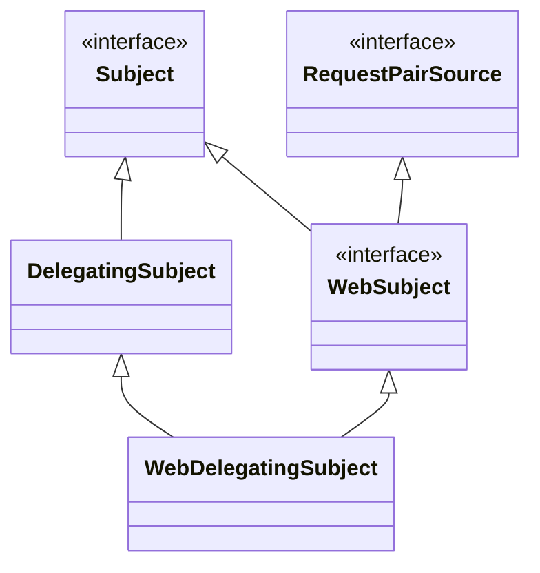
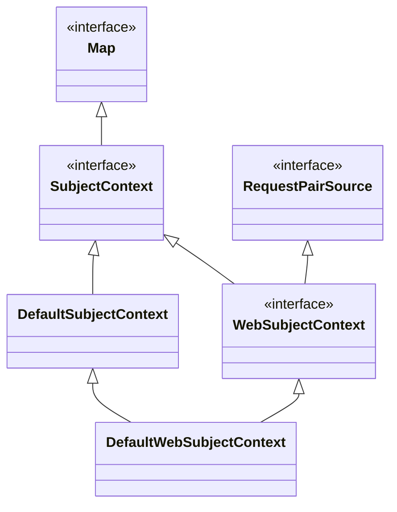
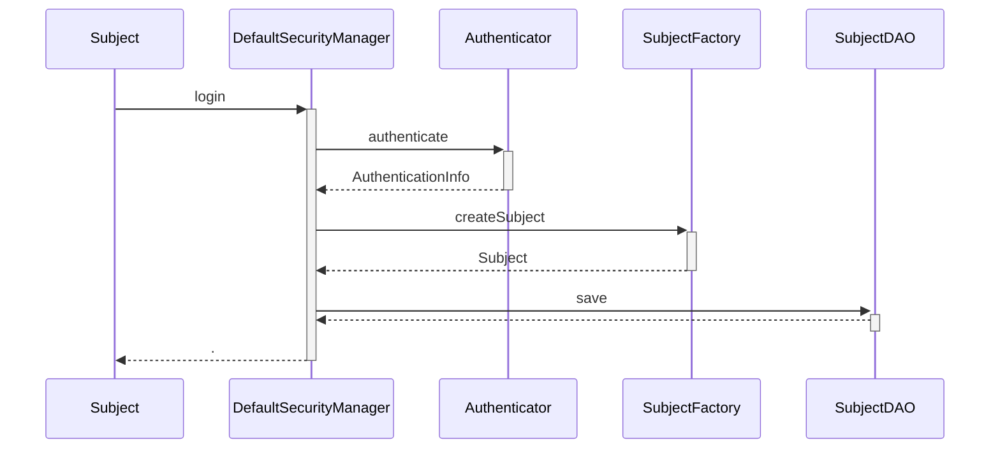

## 前言

`Subject`是 我们在 shiro 框架中，第一个介绍的概念。它表示用户，存储了用户身份认证的相关配置信息。除此之外，还支持登录，退出，session 等接口操作。本篇文章会先介绍`Subject`的种类，然后介绍它是如何创建的，以及登录操作等。


## Subject 类图

`Subject`主要分为两类，一种是在非 Web 环境下使用，另一种是在 Web 环境下使用，包含了 java `Servlet`相关的信息。`Subject`的整个类图如下所示：




`Subject`最为最顶层的接口，定义了用户基本信息的接口、登录相关和权限相关的接口。

`DelegatingSubject`实现了`Subject`接口，在非 Web 环境下使用。

`WebDelegatingSubject`则是在 Web 环境下使用，需要依赖于`Servlet`。


## Subject  实例化


### 工厂类 SubjectFactory

`SubjectFactory`接口时负责创建并且初始化`Subject`

```java
public interface SubjectFactory {
	// 创建 Subject, SubjectContex表示初始化参数
    Subject createSubject(SubjectContext context);
}
```

它有两个子类，`DefaultSubjectFactory`使用在非 Web 环境下，会创建`DelegatingSubject`实例。`DefaultWebSubjectFactory`则对应在 Web 环境下，会创建`WebDelegatingSubject`实例。


### 初始化参数  SubjectContext

`SubjectContext`用于初始化`Subject`的，不同的子类对应着不同类型的`Subject`。比如下面的`DefaultSubjectContext`用作非 Web 环境下的`DelegatingSubject`初始化，而`DefaultWebSubjectContext`用于 Web 环境下的`WebDelegatingSubject`初始化。




`SubjectContext`提供了`SecurityManager`、`Session`、身份凭证`AuthenticationToken`、身份信息`AuthenticationInfo`、客户端 ip 等参数。

`DefaultSubjectContext`实现了`SubjectContext`接口，它相当于`JavaBean`，是上述这些信息的集合类。

`DefaultSubjectContext`只是在`DefaultSubjectContext`基础之上，添加了`ServletRequest`和`ServletResponse`的操作。


## Subject 持久化

`SubjectDAO`接口定义了`Subject`的持久化

```java
public interface SubjectDAO {
    
    // 存储
    Subject save(Subject subject);
    
    // 删除
    void delete(Subject subject);
}
```

目前只有一个实现类`DefaultSubjectDAO`，它的原理也比较简单，使用了 session 存储信息。它只是存储了用户的身份信息和是否已经成功认证。

| session 属性名                                    | 类型                  | 含义                               |
| ------------------------------------------------- | --------------------- | ---------------------------------- |
| `DefaultSubjectContext.AUTHENTICATED_SESSION_KEY` | `PrincipalCollection` | 身份列表（一个用户可能有多个身份） |
| `DefaultSubjectContext.AUTHENTICATED_SESSION_KEY` | Boolean               | 是否通过身份认证                   |


## login 原理

现在我们来看看从`Subject.login`方法开始，看看整个 login 的过程。`Subject`的`login`方法只有`DelegatingSubject`子类实现了，它只是将请求转发给`DefaultSecurityManager`处理。

```java
public class DefaultSecurityManager extends SessionsSecurityManager {
    
    public Subject login(Subject subject, AuthenticationToken token) throws AuthenticationException {
        // 执行身份验证，如果验证失败则会抛出异常
        AuthenticationInfo info = authenticate(token);
        // 验证成功后，创建新的Subject实例
        Subject loggedIn = createSubject(token, info, subject);
        return loggedIn;
    }
}
```


再继续看看`Subject`的创建过程

```java
public class DefaultSecurityManager extends SessionsSecurityManager {

    protected Subject createSubject(AuthenticationToken token, AuthenticationInfo info, Subject existing) {
        // 创建并且初始化SubjectContext
        SubjectContext context = createSubjectContext();
        context.setAuthenticated(true);
        context.setAuthenticationToken(token);
        context.setAuthenticationInfo(info);
        context.setSecurityManager(this);
        if (existing != null) {
            context.setSubject(existing);
        }
        // 使用SubjectContext创建Subject
        return createSubject(context);
    }
    
    public Subject createSubject(SubjectContext subjectContext) {
        // .... 继续设置SubjectContext
        
        // 创建Subject
        Subject subject = doCreateSubject(context);
        
        // 持久化Subject 
        save(subject);
        return subject;
    }
}
```


上面调用了两个方法`doCreateSubject`和`save`方法，最后来看看它们的原理

```java
public class DefaultSecurityManager extends SessionsSecurityManager {

    // 使用SubjectFactory创建
    protected Subject doCreateSubject(SubjectContext context) {
        return getSubjectFactory().createSubject(context);
    }

    //使用SubjectDAO持久化
    protected void save(Subject subject) {
        this.subjectDAO.save(subject);
    }
}
```


整个 login 流程如下图所示：



## logout 原理

在执行`Subject.logout`方法完成登出操作后，shrio 会将`Subject`的信息都设置为空，并且会删除关联的 session。