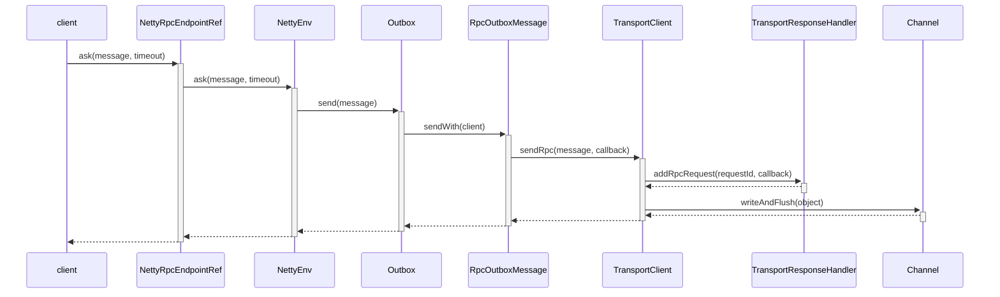

# 客户端介绍 #

## 概览

客户端发送消息如下图：




## 客户端初始化 ###

### NettyRpcEndpointRef初始化 ###

spark rpc的客户端使用EndpointRef类表示，它的唯一实现类是NettyRpcEndpointRef。EndpointRef的实例化，是有RpcEnv负责，RpcEnv的唯一实现类是NettyRpcEnv。

```scala
private[netty] class NettyRpcEnv(
  
  def asyncSetupEndpointRefByURI(uri: String): Future[RpcEndpointRef] = {
    val addr = RpcEndpointAddress(uri)
    val endpointRef = new NettyRpcEndpointRef(conf, addr, this)
    ......
  }

```


### TransportClient初始化 ###

TransportClient负责接收Outbox发送的消息，还有负责返回响应。它会对每一个消息，生成一个requestId。当服务器返回这个请求的响应时，它会调用请求的回调函数。TransportClient还支持权限控制，对应于AuthClientBootstrap类。TransportClient的实例化由TransportClientFactory负责创建，而TransportClientFactory的实例化由TransportContext负责。

```scala
private[netty] class NettyRpcEnv(
  private def createClientBootstraps(): java.util.List[TransportClientBootstrap] = {
    if (securityManager.isAuthenticationEnabled()) {
      java.util.Arrays.asList(new AuthClientBootstrap(transportConf,
        securityManager.getSaslUser(), securityManager))
    } else {
      java.util.Collections.emptyList[TransportClientBootstrap]
    }
  }

  private val clientFactory =   transportContext.createClientFactory(createClientBootstraps())
}
    
```

这里注意到AuthClientBootstrap是作为权限身份验证用的，是TransportClientBootstrap的子类。

然后再来看看TransportClientFactory怎么实例化TransportClient

TransportClientFactory实现了缓存池。对于不同的服务，它都有一个对应的ClientPool。

```scala
  private static class ClientPool {
    TransportClient[] clients;
    Object[] locks;
  }
```

连接池最开始都是空值。当创建TransportClient， 会从对应的连接池，随机的取出TransportClient，如果返回为空，会自动的创建连接，保存到连接池里。

```java
 TransportClient createClient(InetSocketAddress address)
      throws IOException, InterruptedException {
	// 使用Netty的Bootstrap初始化Client
    Bootstrap bootstrap = new Bootstrap();
    bootstrap.group(workerGroup)
      .channel(socketChannelClass)
      // Disable Nagle's Algorithm since we don't want packets to wait
      .option(ChannelOption.TCP_NODELAY, true)
      .option(ChannelOption.SO_KEEPALIVE, true)
      .option(ChannelOption.CONNECT_TIMEOUT_MILLIS, conf.connectionTimeoutMs())
      .option(ChannelOption.ALLOCATOR, pooledAllocator);

    final AtomicReference<TransportClient> clientRef = new AtomicReference<>();
    final AtomicReference<Channel> channelRef = new AtomicReference<>();
	// 初始化ChannelHandler，调用了TransportContext的initializePipeline
    bootstrap.handler(new ChannelInitializer<SocketChannel>() {
      @Override
      public void initChannel(SocketChannel ch) {
        TransportChannelHandler clientHandler = context.initializePipeline(ch);
        clientRef.set(clientHandler.getClient());
        channelRef.set(ch);
      }
    });

    // 连接到服务器
    long preConnect = System.nanoTime();
    ChannelFuture cf = bootstrap.connect(address);
     
     // 执行连接后的动作，比如身份权限验证
    for (TransportClientBootstrap clientBootstrap : clientBootstraps) {
         clientBootstrap.doBootstrap(client, channel);
    }


    return client;
  }
```

注意上面的workerGroup， 表示Netty的工作线程池。这个属性是TransportClientFactory的，所有TransportClient的消息处理都是共用这个线程池。


## 发送消息 ##

```scala
private[netty] class NettyRpcEndpointRef(
    override def ask[T: ClassTag](message: Any, timeout: RpcTimeout): Future[T] = {
    nettyEnv.ask(new RequestMessage(nettyEnv.address, this, message), timeout)
  } 
```

NettyEnv有两种模式，一个是server模式，一个是client模式。当使用client模式时，它的server属性为null，address属性也为null。

```scala
private[netty] def ask[T: ClassTag](message: RequestMessage, timeout: RpcTimeout): Future[T] = {
    val promise = Promise[Any]()
    val remoteAddr = message.receiver.address


    try {
      if (remoteAddr == address) {
        // 这里是客户端才会调用ask方法请求，所以nettyEnv的address是为null
        // 当remoteAddr为null时，则表明Endpoint和EndpointRef是同一个进程
        val p = Promise[Any]()
        p.future.onComplete {
          case Success(response) => onSuccess(response)
          case Failure(e) => onFailure(e)
        }(ThreadUtils.sameThread)
        dispatcher.postLocalMessage(message, p)
      } else {
        // 这里是发送消息给远程Endpoint
        val rpcMessage = RpcOutboxMessage(message.serialize(this),
          onFailure,
          (client, response) => onSuccess(deserialize[Any](client, response)))
        // 发送消息到Outbox
        postToOutbox(message.receiver, rpcMessage)
        promise.future.onFailure {
          case _: TimeoutException => rpcMessage.onTimeout()
          case _ =>
        }(ThreadUtils.sameThread)
      }

    promise.future.mapTo[T].recover(timeout.addMessageIfTimeout)(ThreadUtils.sameThread)
  }
```

这里注意到remoteAddr和address的判断条件，只有client和server在同一个进程，才会由dispather直接转发请求给Endpoint。否则，会将消息转发给Outbox，由Outbox通过网络传送给server。

## 接收响应 ##

TransportChannelHandler是netty的处理消息入口，它包含TransportResponseHandler。当客户端收到服务器的响应时，会转发给TransportResponseHandler处理。

TransportResponseHandler对于rpc类型的消息，都会存储在outstandingRpcs字段里，它是一个HashMap，key为请求的Id，value为回调函数 RpcResponseCallback。当收到消息后，就会调用它。

```scala
public class TransportResponseHandler extends MessageHandler<ResponseMessage> {
  @Override
  public void handle(ResponseMessage message) throws Exception {
  	  
    ................
      
    if (message instanceof RpcResponse) {
      RpcResponse resp = (RpcResponse) message;
      // 根据requestId，找到对应的回调函数
      RpcResponseCallback listener = outstandingRpcs.get(resp.requestId);
      if (listener == null) {
        logger.warn("Ignoring response for RPC {} from {} ({} bytes) since it is not outstanding",
          resp.requestId, getRemoteAddress(channel), resp.body().size());
      } else {
        outstandingRpcs.remove(resp.requestId);
        try {
          // 调用 callback
          listener.onSuccess(resp.body().nioByteBuffer());
        } finally {
          resp.body().release();
        }
      }
    }
```


## 消息序列化

远程调用意味着通信，通信需要制定好数据格式。spark序列化消息，也有统一的标准，RequestMessage就是负责这个。它的序列化是基于java本身的。

### 消息格式

```shell
-----------------------------------------------------------------
sender address |	receiver address	| name       |   content
-----------------------------------------------------------------
address 格式    |    address 格式         | string     | object
-----------------------------------------------------------------
```

上面的address消息分为两种格式，一种值是空，一种非空。

当为空时

```shell
-------------
False   
-------------
Boolean
-------------

```

当不为空时

```shell
-----------------------------
True      | host    |  port 
-----------------------------
Boolean   | string  |  int
------------------------------
```


### RequestMessage

RequestMessage类比较简单，它的serialize方法负责序列化消息。也是使用DataOutputStream的方法，将java的对象转换为字节。

```scala
private[netty] class RequestMessage(
    val senderAddress: RpcAddress,
    val receiver: NettyRpcEndpointRef,
    val content: Any) {

  /** Manually serialize [[RequestMessage]] to minimize the size. */
  def serialize(nettyEnv: NettyRpcEnv): ByteBuffer = {
    val bos = new ByteBufferOutputStream()
    val out = new DataOutputStream(bos)
    try {
      writeRpcAddress(out, senderAddress)
      writeRpcAddress(out, receiver.address)
      out.writeUTF(receiver.name)
      val s = nettyEnv.serializeStream(out)
      try {
        s.writeObject(content)
      } finally {
        s.close()
      }
    } finally {
      out.close()
    }
    bos.toByteBuffer
  }

  private def writeRpcAddress(out: DataOutputStream, rpcAddress: RpcAddress): Unit = {
    if (rpcAddress == null) {
      out.writeBoolean(false)
    } else {
      out.writeBoolean(true)
      out.writeUTF(rpcAddress.host)
      out.writeInt(rpcAddress.port)
    }
  }
```


