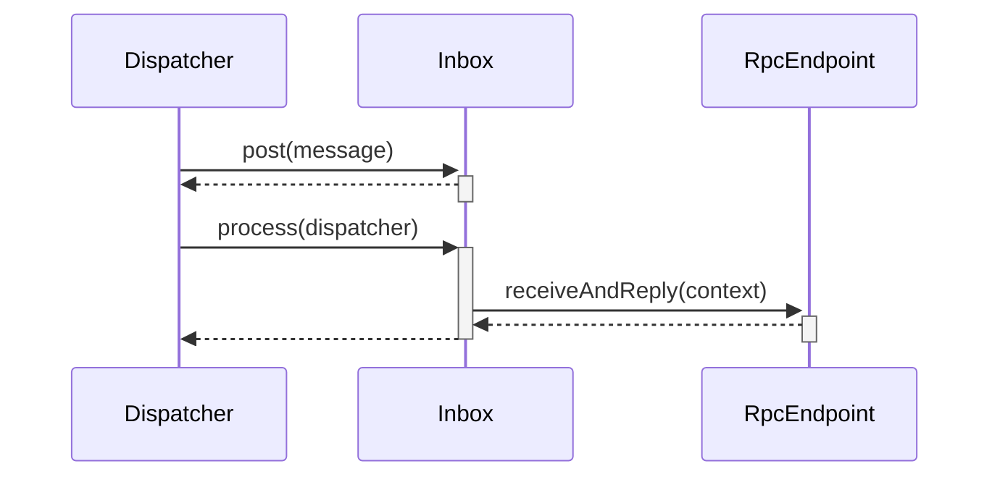

# Spark Rpc 服务端原理 #

Spark Rpc 服务端涉及到多个组件，根据发送消息和接收消息的流程，逐一介绍这些组件。可以参见流程图  

## Rpc Server 启动 ##

Spark Rpc的服务端需要运行在NettyRpcEnv环境下，NettyRpcEnv提供了startServer方法，在NettyRpcEnv环境下负责启动Rpc Server。NettyRpcEnv在启动 Rpc Server时，会将服务注册在Dispatcher里。

```scala
private[netty] class NettyRpcEnv(
    val conf: SparkConf,
    javaSerializerInstance: JavaSerializerInstance,
    host: String,
    securityManager: SecurityManager) extends RpcEnv(conf) with Logging {
  // 消息分发器，负责将消息发送给对应的Rpc Server（因为一个NettyRpcEnv可以运行多个Rpc Server）
  private val dispatcher: Dispatcher = new Dispatcher(this)
  // 初始化TransportContext，传递了NettyRpcHandler，作为netty server的回调
  private val transportContext = new TransportContext(transportConf,
    new NettyRpcHandler(dispatcher, this, streamManager))
      
  def startServer(bindAddress: String, port: Int): Unit = {
    val bootstraps: java.util.List[TransportServerBootstrap] =
      if (securityManager.isAuthenticationEnabled()) {
        java.util.Arrays.asList(new AuthServerBootstrap(transportConf, securityManager))
      } else {
        java.util.Collections.emptyList()
      }
    // 调用transportContext实例TransportServer
    server = transportContext.createServer(bindAddress, port, bootstraps)
    // 向分发器注册自身服务，这样分发器才能根据名称找到服务
    dispatcher.registerRpcEndpoint(
      RpcEndpointVerifier.NAME, new RpcEndpointVerifier(this, dispatcher))
  }
```

TransportContext的createServer方法，只是简单的实例化TransportServer，并传递了RpcHandler参数，这里RpcHandler负责处理rpc消息。接下来看看TransportServer的初始化，里面包含了Netty服务端的初始化

```java
public class TransportServer implements Closeable {

  private final RpcHandler appRpcHandler;
  
  private void init(String hostToBind, int portToBind) {

    IOMode ioMode = IOMode.valueOf(conf.ioMode());
    // 根据io的配置，选择NioEventLoopGroup或者EpollEventLoopGroup
    EventLoopGroup bossGroup =
      NettyUtils.createEventLoop(ioMode, conf.serverThreads(), conf.getModuleName() + "-server");
    // bossGroup和workerGroup是同一个线程池
    EventLoopGroup workerGroup = bossGroup;
    // 使用缓存池分配空间
    PooledByteBufAllocator allocator = NettyUtils.createPooledByteBufAllocator(
      conf.preferDirectBufs(), true /* allowCache */, conf.serverThreads());

    // Netty初始化
    bootstrap = new ServerBootstrap()
      .group(bossGroup, workerGroup)
      .channel(NettyUtils.getServerChannelClass(ioMode))
      .option(ChannelOption.ALLOCATOR, allocator)
      .childOption(ChannelOption.ALLOCATOR, allocator);
    // 初始化Netty的时间处理回调
    bootstrap.childHandler(new ChannelInitializer<SocketChannel>() {
      @Override
      protected void initChannel(SocketChannel ch) throws Exception {
        RpcHandler rpcHandler = appRpcHandler;
        for (TransportServerBootstrap bootstrap : bootstraps) {
          rpcHandler = bootstrap.doBootstrap(ch, rpcHandler);
        }
        // 这里调用了TransportContext的方法，添加channel的处理器
        context.initializePipeline(ch, rpcHandler);
      }
    });

    InetSocketAddress address = hostToBind == null ?
        new InetSocketAddress(portToBind): new InetSocketAddress(hostToBind, portToBind);
    // 绑定监听地址
    channelFuture = bootstrap.bind(address);
    channelFuture.syncUninterruptibly();

    port = ((InetSocketAddress) channelFuture.channel().localAddress()).getPort();
    logger.debug("Shuffle server started on port: {}", port);
  }
}  
```

上面调用了TransportContext的initializePipeline方法，给Channel添加了TransportChannelHandler。TransportChannelHandler继承ChannelInboundHandlerAdapter，实现了channelRead方法来处理请求。

```java
public class TransportChannelHandler extends ChannelInboundHandlerAdapter {
    
  @Override
  public void channelRead(ChannelHandlerContext ctx, Object request) throws Exception {
    if (request instanceof RequestMessage) {
      // 调用了TransportRequestHandler处理请求
      requestHandler.handle((RequestMessage) request);
    } else if (request instanceof ResponseMessage) {
      responseHandler.handle((ResponseMessage) request);
    } else {
      ctx.fireChannelRead(request);
    }
  }
}  
```

##  TransportRequestHandler 

TransportRequestHandler可以处理多种请求，这里只将Rpc请求。它接收到Rpc请求后，会调用processRpcRequest方法处理。这里的RpcHandler就是Netty创建Server的时候，生成的NettyRpcHandler。

```java
public class TransportRequestHandler extends MessageHandler<RequestMessage> {
    
  private final RpcHandler rpcHandler;

  @Override
  public void handle(RequestMessage request) {
    if (request instanceof ChunkFetchRequest) {
      processFetchRequest((ChunkFetchRequest) request);
    } else if (request instanceof RpcRequest) {
      processRpcRequest((RpcRequest) request);
    } else if (request instanceof OneWayMessage) {
      processOneWayMessage((OneWayMessage) request);
    } else if (request instanceof StreamRequest) {
      processStreamRequest((StreamRequest) request);
    } else {
      throw new IllegalArgumentException("Unknown request type: " + request);
    }
  }

  private void processRpcRequest(final RpcRequest req) {
    try {
      rpcHandler.receive(reverseClient, req.body().nioByteBuffer(), new RpcResponseCallback() {
        @Override
        public void onSuccess(ByteBuffer response) {
          respond(new RpcResponse(req.requestId, new NioManagedBuffer(response)));
        }

        @Override
        public void onFailure(Throwable e) {
          respond(new RpcFailure(req.requestId, Throwables.getStackTraceAsString(e)));
        }
      });
    } catch (Exception e) {
      logger.error("Error while invoking RpcHandler#receive() on RPC id " + req.requestId, e);
      respond(new RpcFailure(req.requestId, Throwables.getStackTraceAsString(e)));
    } finally {
      req.body().release();
    }
  }
}    
```


## NettyRpcHandler

NettyRpcHandler的receive方法，首先调用了internalReceive生成RequestMessage，然后转发给dispatcher。

NettyRpcHandler还有个属性remoteAddresses，它保存了client的地址。通过remoteAddresses， 可以确定这个client是否为新连接。每当新的client连接时，都会发送一个RemoteProcessConnected消息。

```scala
private[netty] class NettyRpcHandler {
    
  override def receive(
      client: TransportClient,
      message: ByteBuffer,
      callback: RpcResponseCallback): Unit = {
    val messageToDispatch = internalReceive(client, message)
    dispatcher.postRemoteMessage(messageToDispatch, callback)
  }

  private def internalReceive(client: TransportClient, message: ByteBuffer): RequestMessage = {
    val addr = client.getChannel().remoteAddress().asInstanceOf[InetSocketAddress]
    assert(addr != null)
    val clientAddr = RpcAddress(addr.getHostString, addr.getPort)
    val requestMessage = RequestMessage(nettyEnv, client, message)
    if (requestMessage.senderAddress == null) {
      // client和server在同一个进程
      new RequestMessage(clientAddr, requestMessage.receiver, requestMessage.content)
    } else {
      val remoteEnvAddress = requestMessage.senderAddress
      if (remoteAddresses.putIfAbsent(clientAddr, remoteEnvAddress) == null) {
        //  如果是新连接的client，给所有的endpoint发送消息
        dispatcher.postToAll(RemoteProcessConnected(remoteEnvAddress))
      }
      requestMessage
    }
  }
}
```


## Dispatcher

Dispatcher负责管理消息的分发，它包含多个服务。当Dispatcher接收到消息后，会根据消息中的名称，发送到对应的服务。服务RpcEndpoint的信息都会保存在endpoints哈希表里。key值为RpcEndpoint的名称，value为EndpointData。EndpointData包含了服务对应的消息收件箱。

```java
private[netty] class Dispatcher(nettyEnv: NettyRpcEnv) extends Logging {

  private class EndpointData(
      val name: String,
      val endpoint: RpcEndpoint,
      val ref: NettyRpcEndpointRef) {
    val inbox = new Inbox(ref, endpoint)
  }

  private val endpoints: ConcurrentMap[String, EndpointData] =
    new ConcurrentHashMap[String, EndpointData]
    
}
```

上面NettyRpcHandler调用了Dispatcher的postRemoteMessage方法，来将消息分发给对应的服务。

```scala
private[netty] class Dispatcher(nettyEnv: NettyRpcEnv) extends Logging {
  // RpcEndpoint集合
  private val endpoints: ConcurrentMap[String, EndpointData] =
    new ConcurrentHashMap[String, EndpointData]
    
  def postRemoteMessage(message: RequestMessage, callback: RpcResponseCallback): Unit = {
    val rpcCallContext =
      new RemoteNettyRpcCallContext(nettyEnv, callback, message.senderAddress)
    // 创建RpcMessage消息，调用postMessage方法发送
    val rpcMessage = RpcMessage(message.senderAddress, message.content, rpcCallContext)
    // 请求消息message，包含了要请求服务的名称
    postMessage(message.receiver.name, rpcMessage, (e) => callback.onFailure(e))
  }
    
  private def postMessage(
      endpointName: String,
      message: InboxMessage,
      callbackIfStopped: (Exception) => Unit): Unit = {
    val error = synchronized {
      // 获取对应的EndpointData
      val data = endpoints.get(endpointName)
      if (stopped) {
        Some(new RpcEnvStoppedException())
      } else if (data == null) {
        Some(new SparkException(s"Could not find $endpointName."))
      } else {
        // 发送给对应的inbox
        data.inbox.post(message)
        receivers.offer(data)
        None
      }
    }
    // We don't need to call `onStop` in the `synchronized` block
    error.foreach(callbackIfStopped)
  }
}
```


## Inbox

Inbox 代表着收件箱，一个Inbox对应着一个服务。请求该服务的消息，都由Inbox接收，然后转发给RpcEndpoint处理。




Inbox提供了post方法接收消息，它会将消息都会存储到队列里面。

Dispatcher的后台线程会调用Inbox的process方法，从队列取出和处理消息。

### 处理消息 ###

首先看Inbox的process方法，它会循环从队列里获取和处理消息。 对于不同的消息会有不同的处理。

```scala
private[netty] class Inbox(
    val endpointRef: NettyRpcEndpointRef,
    val endpoint: RpcEndpoint)
  extends Logging {
      
  def process(dispatcher: Dispatcher): Unit = {
    var message: InboxMessage = null
    inbox.synchronized {
      // 如果该服务不支持多线程，那么只允许一个线程处理消息
      if (!enableConcurrent && numActiveThreads != 0) {
        return
      }
      // 从队列中获取消息
      message = messages.poll()
      if (message != null) {
        numActiveThreads += 1
      } else {
        return
      }
    }
    while (true) {
      safelyCall(endpoint) {
        message match {
          // Rpc消息，需要返回响应
          case RpcMessage(_sender, content, context) =>
            try {
              // 这里调用了endpoint的receiveAndReply方法处理消息
              endpoint.receiveAndReply(context).applyOrElse[Any, Unit](content, { msg =>
                throw new SparkException(s"Unsupported message $message from ${_sender}")
              })
            } catch {
              case NonFatal(e) =>
                context.sendFailure(e)
                // Throw the exception -- this exception will be caught by the safelyCall function.
                // The endpoint's onError function will be called.
                throw e
            }
          // 不需要响应的Rpc消息
          case OneWayMessage(_sender, content) =>
            // 这里调用了endpoint的receive方法处理消息
            endpoint.receive.applyOrElse[Any, Unit](content, { msg =>
              throw new SparkException(s"Unsupported message $message from ${_sender}")
            })
          // 启动消息，在Inbox初始化时会发送
          case OnStart =>
            // 调用endpoint的OnStart回调函数
            endpoint.onStart()
            }
          // 退出消息
          case OnStop =>
            val activeThreads = inbox.synchronized { inbox.numActiveThreads }
            assert(activeThreads == 1,
              s"There should be only a single active thread but found $activeThreads threads.")
            // 从dispatcher注销该服务
            dispatcher.removeRpcEndpointRef(endpoint)
            // 调用endpoint的OnStop回调函数
            endpoint.onStop()
      }
    }
  }
}
```

上面在处理RpcMessage消息时， 调用了RpcEndpoint的方法。

```scala
private[spark] trait RpcEndpoint {
  def receiveAndReply(context: RpcCallContext): PartialFunction[Any, Unit] = {
    case _ => context.sendFailure(new SparkException(self + " won't reply anything"))
  }
}
```

可以看出消息最后转发给RpcEndpoint的receiveAndReply方法。receiveAndReply返回了偏函数，PartialFunction[Any, Unit]， 然后调用偏函数。如果自定义RpcEndpoint，必须实现receiveAndReply方法，使用case语句生成偏函数。可以参见这篇博客   的HelloEndpoint服务。

### 消息处理线程 ###

Inbox的消息队列由Dispatcher的线程池负责处理，首先看看线程池的创建

```scala
private val threadpool: ThreadPoolExecutor = {
    val numThreads = nettyEnv.conf.getInt("spark.rpc.netty.dispatcher.numThreads",
      math.max(2, Runtime.getRuntime.availableProcessors()))
    val pool = ThreadUtils.newDaemonFixedThreadPool(numThreads, "dispatcher-event-loop")
    for (i <- 0 until numThreads) {
      pool.execute(new MessageLoop)
    }
    pool
  }
```

Dispatcher的线程池会运行MessageLoop任务。MessageLoop会调用Inbox的process方法处理消息。

当有消息通过Dispatcher分发时，Dispatcher会将服务的信息添加到 receivers队列里，所以这个队列会保存着有消息的服务。MessageLoop会循环从receivers中获取EndpointData，然后调用Inbox的process方法处理消息。

```scala
  private class MessageLoop extends Runnable {
    override def run(): Unit = {
      try {
        while (true) {
          try {
            // 从receivers队列获取EndpointData
            val data = receivers.take()
            if (data == PoisonPill) {
              // Put PoisonPill back so that other MessageLoops can see it.
              receivers.offer(PoisonPill)
              return
            }
            data.inbox.process(Dispatcher.this)
          } catch {
            case NonFatal(e) => logError(e.getMessage, e)
          }
        }
      } catch {
        case ie: InterruptedException => // exit
      }
    }
  }
```


## 发送响应 ##

这里注意到Dispatcher分发消息的时候，实例化了RemoteNettyRpcCallContext， 它提供了send或reply方法，返回数据。

```scala
private[netty] class RemoteNettyRpcCallContext(
    nettyEnv: NettyRpcEnv,
    callback: RpcResponseCallback,
    senderAddress: RpcAddress)
  extends NettyRpcCallContext(senderAddress) {

  override protected def send(message: Any): Unit = {
    // 序列化结果
    val reply = nettyEnv.serialize(message)
    // 调用回调函数
    callback.onSuccess(reply)
  }
}
```

这里send方法，是调用了RpcResponseCallback回调函数。callback的定义，在TransportRequestHandler的processRpcRequest方法里。这里调用了TransportRequestHandler的respond方法。

```java
@Override
public void onSuccess(ByteBuffer response) {
    respond(new RpcResponse(req.requestId, new NioManagedBuffer(response)));
}
```

继续看respond方法，调用Channel的writeAndFlush将数据发送出去。

```java
  private void respond(Encodable result) {
    SocketAddress remoteAddress = channel.remoteAddress();
    channel.writeAndFlush(result).addListener(future -> {
      if (future.isSuccess()) {
        logger.trace("Sent result {} to client {}", result, remoteAddress);
      } else {
        logger.error(String.format("Error sending result %s to %s; closing connection",
          result, remoteAddress), future.cause());
        channel.close();
      }
    });
  }
```


