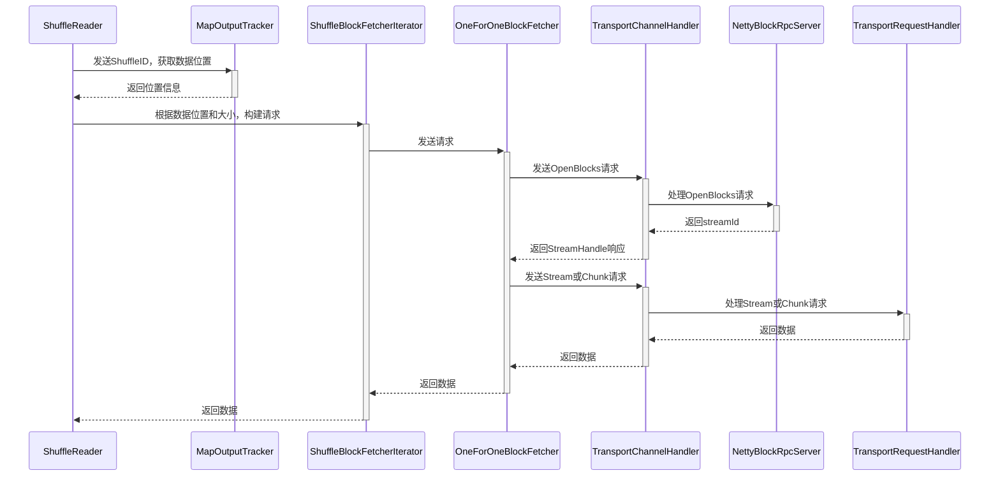

## 前言

Shuffle 操作在 Spark 中很常见，往往用于聚合或重新分区等场景。Shuffle 操作特别费时，会造成极大的磁盘 IO 和网络 IO，经常是整个任务的性能瓶颈。所以了解下 shuffle 的原理很重要，可以根据其原理进行调优。本篇介绍 shuffle 数据读取的原理。


## Shuffle 简介

如下图展示了一个 shuffle 操作，有两个 Map 节点，为两个 Reduce 节点生成 shuffle 数据，数据保存在 Map 节点的磁盘上。这里共有四份数据，每份数据通过 mapId 和 reduceId 就可以唯一的确认。


上图只是展示了一个 Shuffle 操作，如果一个任务有多个 Shuffle，还需要 shuffleId 才能唯一确认数据。ShuffleBlockId 包含 shuffleId，mapId 和 reduceId，在请求数据中会用到它。


## 读取流程

reduce 端读取 shuffle 数据的流程，涉及到多个类，比较复杂。




1. shuffle 数据的位置获取，从MapOutputTracker获取数据所在的位置。
2. ShuffleBlockFetcherIterator 根据 shuffle 数据的位置，分为本地和远程。远程数据需要构建请求。
3. OneForOneBlockFetcher 负责发送远程请求，它需要向请求OpenBlocks，会收到StreamHandler响应。
4. NettyBlockRpcServer 负责处理OpenBlocks请求，会根据 ShuffleBlockId 列表，找到对应的数据位置，准备好数据。最后生成streamId 和 chunkId 列表，这样客户端通过 streamId 和 chunkId 就可以获取数据了。
5. OneForOneBlockFetcher 接收到StreamHandler响应后。如果指定了要将数据存储到文件，那么就发送Stream请求。否则发送Chunk请求，数据会保存在内存中。
6. TransportRequestHandler 处理 Stream 或Chunk 请求，会通过 StreamManager 返回数据。


## 生成请求

首先根据 shuffle 数据所在的位置，分为本地数据和远程数据。本地数据直接从文件中即可读取，而远程数据需要通过网络传输。ShuffleBlockFetcherIterator 作为数据迭代器，会先返回本地数据，然后返回远程数据。这样也就减少了等待远程数据的传输时间。


### 生成远程请求

因为数据可能分配在多个节点上，为了提高传输的效率，需要合并相同节点的数据请求，但是为了不影响稳定性，一次请求又不能返回太多数据。下面详细讲述了实现的原理。

首先根据数据的所在节点进行分组。然后将组里的数据，根据大小进一步分组。一个请求包包含的数据总和，基本控制在一定大小。这里举个例子说明，假设有多份数据，并且控制大小为100MB。

| 数据名称 | 位置 | 大小  |
| -------- | ---- | ----- |
| A1       | A    | 80MB  |
| A2       | A    | 40MB  |
| A3       | A    | 50MB  |
| B1       | B    | 120MB |

  	

结果会生成下列三个请求，

| 请求ID | 数据列表 |
| ------ | -------- |
| 0      | A1, A2   |
| 1      | A3       |
| 2      | B1       |

过程解析：

1. 首先来看位置 A 的数据，依次遍历它的三份数据 A1，A2，A3，首先 A1 和 A2 的数据大小之和，大于 100MB，所以生成第一个请求。
2. 然后只剩下 A3 一份请求在位置 A上，所以生成第二个请求。
3. B位置的数据同理，生成第三个请求。


### 并发请求

上面已经生成了请求，现在如何将其高效率的发送出去。spark 基于 Netty 来实现异步传输的，但是同时还实现了并发的限制：

- 正在发送的请求数，不能超过指定数量，由 spark.reducer.maxReqsInFlight 配置表示，默认 Int.MaxValue，可以认为无限制。
- 正在请求的数据大小总和，不能超过指定数量，由spark.reducer.maxSizeInFlight 配置表示，默认为 48MB。

对于每次请求的方式，也会根据数据的大小有所不同，阈值为 spark.reducer.maxReqSizeShuffleToMem 配置：

- 如果请求的数据比阈值大，spark 会使用 stream 模式请求，也就是将数据存储到文件里。
- 如果请求的数据比阈值小，spark 会使用 chunk 模式请求，也就是将数据存储到内存里。


比较奇怪的，这个阈值默认是 Long.MaxValue，几乎是无限大。如果发生了shuffle 倾斜，这就很容易造成内存溢出了。建议修改配置的值大小，不要超过 Executor 的本地内存大小。如果使用 Yarn 资源调度，可以参考此篇博客  ，了解内存如何分配。


## ShuffleClient 类图

ShuffleClient 作为读取远程数据的基类，定义了重要的 fetchBlocks 接口。



@startuml
abstract class ShuffleClient
class BlockTransferService
class NettyBlockTransferService
class ExternalShuffleClient
class MesosExternalShuffleClient

ShuffleClient <|-- BlockTransferService
BlockTransferService <|-- NettyBlockTransferService
ShuffleClient <|-- ExternalShuffleClient
ExternalShuffleClient <|-- MesosExternalShuffleClient

@enduml



ShuffleClient表示shuffle 数据的客户端，支持远程读取数据。

BlockTransferService继承ShuffleClient，增加了上传数据。

NettyBlockTransferService继承BlockTransferService， 实现了所有的接口 。

ExternalShuffleClient 实现外部 ShuffleService 的连接，原理参见下篇博客。


## 发送请求

Shuffle 数据的远程读取由 NettyBlockTransferService 负责，它使用 OneForOneBlockFetcher 实现远程获取。

### 数据初始化请求

OneForOneBlockFetcher 首先发送 OpenBlocks Rpc 请求，通知服务端。

```java
public class OpenBlocks extends BlockTransferMessage {
  public final String appId; // spark app id
  public final String execId;  // executor id
  public final String[] blockIds; // 获取的block id列表
}
```

服务端为请求的数据生成 streamId 和 chunkId，并且做好数据准备，返回 StreamHandle 响应。

```java
public class StreamHandle extends BlockTransferMessage {
  public final long streamId; // 分配的stream id
  public final int numChunks; // 多少块 
}
```


### 读取数据

读取数据分为两种模式：

1. stream 模式，表示接收的数据会直接存储到文件。
2. chunk 模式，表示数据会存到内存里。

stream 模式下的回调函数如下所示，只要有接收到数据，那么就直接执行 onData 方法：

```java
private class DownloadCallback implements StreamCallback {
    private WritableByteChannel channel = null;
    
    // 只要接收到数据，就会立马写入到文件中
    public void onData(String streamId, ByteBuffer buf) throws IOException {
        channel.write(buf);
    }
    
    // 获取数据完成后，会通知listener
    public void onComplete(String streamId) throws IOException {
        channel.close();
        // 基于文件封装的buffer
        ManagedBuffer buffer = new FileSegmentManagedBuffer(transportConf, targetFile, 0, targetFile.length());
        // 执行listener回调函数
        listener.onBlockFetchSuccess(blockIds[chunkIndex], buffer);
    }
}
```

chunk 模式下的回调函数，它只有将数据全部存储到内存中，才会执行 onSuccess 方法。

```java
private class ChunkCallback implements ChunkReceivedCallback {
    // buffer是netty分配的堆外内存
    public void onSuccess(int chunkIndex, ManagedBuffer buffer) {
        listener.onBlockFetchSuccess(blockIds[chunkIndex], buffer);
    }
}
```


## 服务端处理 Rpc 请求

服务端是基于 netty 框架实现的，它的核心处理 由 NettyBlockRpcServer 类负责。它继承了RpcHandler，负责处理 OpenBlocks  请求。服务端收到请求后会进行一些准备操作，找到数据的位置并且生成 streamId 和 chunkId 列表，这些都会保存起来。这样客户端下次根据 streamId 和 chunkId 请求数据，服务端就可以直接返回数据了。

```scala
class NettyBlockRpcServer(appId: String, serializer: Serializer, blockManager: BlockDataManager) extends RpcHandler with Logging {
  // 数据读取请求管理
  private val streamManager = new OneForOneStreamManager()    
    
    override def receive(
      client: TransportClient, rpcMessage: ByteBuffer, responseContext: RpcResponseCallback): Unit = {
    	val message = BlockTransferMessage.Decoder.fromByteBuffer(rpcMessage)
    	message match {
            case openBlocks: OpenBlocks =>
                val blocksNum = openBlocks.blockIds.length
                // 针对每个blockId，生成FileSegmentManagedBuffer
                val blocks = for (i <- (0 until blocksNum).view)
                  yield blockManager.getBlockData(BlockId.apply(openBlocks.blockIds(i)))
            	// 生成streamId，并且在StreamManager注册
            	val streamId = streamManager.registerStream(appId, blocks.iterator.asJava)
            	// 响应StreamHandle结果
            	responseContext.onSuccess(new StreamHandle(streamId, blocksNum).toByteBuffer)
            
            // .....
    }
  }
```

从上面可以看到时调用了 blockManager 的方法，才找到了数据。我们知道 Map 端程序生成的 多份 shuffle 数据，最后都合并成了一个大文件，然后为了方便的找到每份数据的位置，生成了索引文件。blockManager 读取索引文件，根据 reduceId 就可以很快的找到位置。

OneForOneStreamManager 负责数据读取的流管理。之前服务端找到的数据，都会存储到到它这里。然后 OneForOneStreamManager  负责生成唯一递增的 streamId，为每份数据生成唯一的 chunkId。

```java
public class OneForOneStreamManager extends StreamManager {
  // 用来生成递增唯一的streamId
  private final AtomicLong nextStreamId;
  // 根据streamId 找到对应的数据，数据由StreamState表示
  private final ConcurrentHashMap<Long, StreamState> streams;
  
  // 注册stream数据
  public long registerStream(String appId, Iterator<ManagedBuffer> buffers) {
    // 生成streamId
    long myStreamId = nextStreamId.getAndIncrement();
    // 保存数据到Map集合
    streams.put(myStreamId, new StreamState(appId, buffers));
    return myStreamId;
  }
}
```


## 服务端处理流请求

流请求由 TransportRequestHandler 负责处理，它也是基于 Netty 框架实现的，原理可以参考这篇博客  。TransportRequestHandler 负责处理 chunk 或 stream 模式的请求，它的原理是调用 OneForOneStreamManager 返回数据。

OneForOneStreamManager 的 openStream 方法处理 stream 请求，getChunk 方法处理 chunk 请求。这些请求都必须按照顺序读取数据。

```java
public class OneForOneStreamManager extends StreamManager {
    
  private final ConcurrentHashMap<Long, StreamState> streams;
   
  // 负责处理stream请求
  public ManagedBuffer openStream(String streamChunkId) {
    // 解析字符串，分离streamId和chunkId
    Tuple2<Long, Integer> streamIdAndChunkId = parseStreamChunkId(streamChunkId);
    // 最后也是调用了 getChunk 方法返回数据
    return getChunk(streamIdAndChunkId._1, streamIdAndChunkId._2);
  }
    
  // 处理chunk请求
  public ManagedBuffer getChunk(long streamId, int chunkIndex) {
    // 根据 streamId 找到对应的数据列表
    StreamState state = streams.get(streamId);
    // 数据的读取必须按照顺序来，StreamState 存储了读取的位置，这里需要做校检
    if (chunkIndex != state.curChunk) {
      throw new IllegalStateException(String.format("Received out-of-order chunk index %s (expected %s)", chunkIndex, state.curChunk));
    } else if (!state.buffers.hasNext()) {
      throw new IllegalStateException(String.format("Requested chunk index beyond end %s", chunkIndex));
    }
    // 更新读取位置
    state.curChunk += 1;
    // 返回数据
    ManagedBuffer nextChunk = state.buffers.next();

    if (!state.buffers.hasNext()) {
      logger.trace("Removing stream id {}", streamId);
      streams.remove(streamId);
    }

    return nextChunk;
  }
}   
```


## 客户端合并数据

客户端收到数据后，先会解析数据，然后合并这些多份数据，生成一个迭代器。合并的逻辑比较简单，分为下面三种：

如果没有聚合操作，那么只是简单的合并成一个迭代器。

如果有聚合操作，则调用 Aggregator 方法完成聚合操作。

如果有排序要求，则调用 ExternalSorter 完成排序操作。

