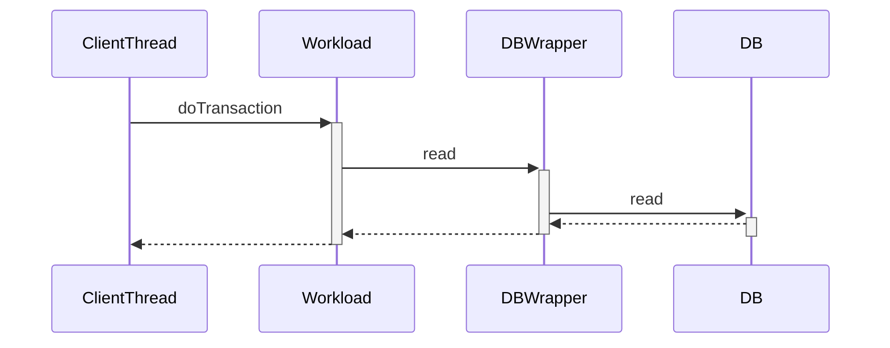

## 前言

ycsb 作为雅虎开源的基准测试框架，支持多种数据库的性能测试，也能通过生成满足指定概率分布的数据，来模拟实际的并发场景。ycsb 的用法也很简单，本篇文章主要介绍 ycsb 框架的原理。

## 测试流程

框架的测试流程很简单，如下图所示


Main ： 负责框架的启动，它会解析参数并且负责初始化，比如线程组的初始化，统计计算的初始化

工作线程组：负责实际的增删改查操作

统计计算：负责统计请求的响应时间，计算出平均值，最大最小值，还有 tp95 和 tp99 等指标

统计结果导出：负责将上一部的统计结果，以文本格式或 json 格式导出到标准输出或文件


## 工作线程组

工作线程组有着下列三种线程，

- 工作线程 ClientThread，它会自动构建请求，发送到数据库，并且将响应时间汇报给统计计算
- 终止工作线程 TerminatorThread，如果指定了运行时间，那么它就会定时发送终止信号，通知 ClientThread 停止
- 汇报进度线程 StatusThread，它会定期获取 ClientThread 的请求已发送数和未发送数，输出完成进度


## 工作线程原理

工作线程 ClientThread 会根据配置的并发数，来发送指定数量的请求。它读写数据库的实现，由三个组件完成：

DB 类负责实现底层的数据库操作，支持增删改查等操作

DBWrapper 类包装了 DB，提供了记录请求时间的功能

Workload 类实现了按照概率分布，来构建请求

下图以执行 read 操作为例




## 数据库抽象层 DB

因为 ycsb 框架支持多种数据库，所以它将底层的数据库操作封装了一层，由 DB 类表示。这样如果用户需要增加特定数据库的支持，只需要继承 DB 类，实现对应的增删改查接口就行。下面列举了操作接口，

```java
public abstract class DB {

  public abstract Status read(String table, String key, Set<String> fields, Map<String, ByteIterator> result);

  public abstract Status scan(String table, String startkey, int recordcount, Set<String> fields,
                              Vector<HashMap<String, ByteIterator>> result);
  
  public abstract Status update(String table, String key, Map<String, ByteIterator> values);

  public abstract Status insert(String table, String key, Map<String, ByteIterator> values);
    
  public abstract Status delete(String table, String key);
}
```

注意到DB 除了增删改查四个操作，还新增了一个 scan 操作。它表示范围查询，在一些 nosql 数据库（比如HBase）中有单独的 scan 操作。在 sql 数据库中，ycsb 使用语句  `WHERE id >= target_value ORDER BY id LIMIT number` 来表示。


## DBWrapper

上面介绍了 DB 的原理了，它负责直接的数据库操作。DBWrapper 封装了 DB 操作，采用了代理模式，它增加了数据统计的作用。下面以 read 方法为例，

```java
public class DBWrapper extends DB {
  private final DB db;
  private final Measurements measurements;
  private final Tracer tracer;
  
  public Status read(String table, String key, Set<String> fields,
                     Map<String, ByteIterator> result) {
    // 开启 HTrace 跟踪
    try (final TraceScope span = tracer.newScope(scopeStringRead)) {
      // 获取测试开始的起始时间
      long ist = measurements.getIntendedtartTimeNs();
      // 记录请求时间
      long st = System.nanoTime();
      Status res = db.read(table, key, fields, result);
      long en = System.nanoTime();
      // 记录响应时间值
      measure("READ", res, ist, st, en);
      // 记录响应状态，是否成功
      measurements.reportStatus("READ", res);
      return res;
    }
  }
}
```

DBWrapper 使用 HTrace 支持分布式跟踪，使用 Measurements 进行数据统计。Measurements 的原理下面会有介绍


## Workload


### 工作模式

Workload 有两种工作模式，load 模式和测试模式。

如果指定了 load 参数，表示执行 load 模式，它会负责生成测试数据。

测试模式是指进行实际的读写测试，生成测试报告。

上面这两种测试模式对应两个方法

```java
public abstract class Workload {
  // 对应load模式
  public abstract boolean doInsert(DB db, Object threadstate);
  // 对应测试模式
  public abstract boolean doTransaction(DB db, Object threadstate);
}
```


### uml 类



@startuml
abstract class Workload
class CoreWorkload
class ConstantOccupancyWorkload
class TimeSeriesWorkload
class RestWorkload

Workload <|-- CoreWorkload
CoreWorkload <|-- ConstantOccupancyWorkload
CoreWorkload <|-- RestWorkload
Workload <|-- TimeSeriesWorkload
@enduml



- Workload 只是一个基类，它的子类负责底层的实现。
- CoreWorkload 作为常见的实现方式，下面会详细介绍。
- RestWorkload 用来测试 restful 接口。
- TimeSeriesWorkload 用来测试时序数据。
- ConstantOccupancyWorkload 可以参考磁盘空间，来确定请求数量。

在进一步介绍 CoreWorkload 之前，需要了解一下数据生成器。因为 CoreWorkload 在构建请求时，会用到它来生成数据。


## 数据生成原理

ycsb 不仅支持多种数据库，而且还能生成不同概率分布的的数据，来模拟现实的各种情况。它支持多种概率分布，比如均匀分布，热点分布，zipfun 分布等。

ycsb 支持生成三种类型的数据，数字类型，字符串类型，时间戳类型。下面来看看它的实现原理


### 基类介绍

数据生成的基类是 Generator，子类需要实现它的两个接口。

```java
public abstract class Generator<V> {
  // 生成新的数据
  public abstract V nextValue();
 
  // 返回上一次的数据
  public abstract V lastValue();
}
```


### 数字类型

数字类型的生成由 NumberGenerator 类和它的子类构成。它的子类比较多，分为规律型和概率型。


规律型

ConstantIntegerGenerator ，返回常量，也就是返回的值都是一样的

CounterGenerator，返回值递增加一，可以通过 insertstart 参数指定起始值，默认为 0。

SequentialGenerator， 返回整数。可以给定取值范围，递增轮询返回。


概率型

我们知道计算机的随机实现其实是伪随机，这里简单认为随机数的概率分布为均匀分布，记为随机变量 X。

ExponentialGenerator， 对数分布概率。变量 X 为等概率分布，取值范围是 ( 0， 1 ]，返回值为 `constanct * log X` 。这种分布会造成数据倾向于大值。

HistogramGenerator ，初始化直方图， 假设随机一个整数 X，它会遍历每个分区的数值，知道累积的值大于 X，就返回这个bucket 。如果遍历完还没达到条件，则返回最后一个。

HotspotIntegerGenerator， 热点数据分布。原理是给定值的分布范围，将其切割为热点数据和非热点数据两段。然后根据设置的热点数据概率，生成数据。

ZipfianGenerator，满足 zipfian 概率分布。

UniformLongGenerator， 给定区间范围，满足均匀分布。

SkewedLatestGenerator， 在ZipfianGenerator基础上，增加了递增的偏移值。


### 字符串类型

DiscreteGenerator， 给定取值集合和对应的权重，返回值的概率为权重比例。

FileGenerator，给定数据文件，按照顺序依次读取并返回一行数据。

IncrementingPrintableStringGenerator， 给定字符串的取值集合，生成多个字符串，然后连接成一个字符串。每条数据都是由上条数据递增加一的结果。

UniformGenerator，给定字符串的取值集合，然后等概率的从中取值。


### 时间戳类型

UnixEpochTimestampGenerator， 给定起始时间戳和时间单位。每个生成的值都是递增的，递增的差值为时间单元的固定倍数。

RandomDiscreteTimestampGenerator， 每次生成的值也是递增的，不过递增的差值为时间单元的随机倍数。


## 构建请求

在上面介绍了数据的生成，现在要介绍如何应用到构建请求。我们继续了解 CoreWorkload 的原理


### load 模式

```java
public class CoreWorkload extends Workload {
  protected NumberGenerator keysequence; // 生成主键，类型为CounterGenerator
  
  private List<String> fieldnames; // 字段名集合
  protected NumberGenerator fieldlengthgenerator; // 在构建字段值，指定字段的数据长度
    
  public boolean doInsert(DB db, Object threadstate) {
    // 生成主键
    int keynum = keysequence.nextValue().intValue();
    String dbkey = buildKeyName(keynum);
    // 生成字段值，每个字段的长度都是通过 fieldlengthgenerator 生成的
    HashMap<String, ByteIterator> values = buildValues(dbkey);
    // 调用 DB 完成底层插入
    status = db.insert(table, dbkey, values);      
    // .....
}   
```


### 测试模式

测试模式负责实际的读写性能测试。它支持5种类型的请求 READ，INSERT，UPDATE，DELETE， SCAN，READMODIFYWRITE。上面新增了一个操作类型 READMODIFYWRITE， 表示对数据先读取，然后再更改。

```java
public class CoreWorkload extends Workload {
  // 按照概率返回操作类型（READ，INSERT，UPDATE，DELETE， SCAN，READMODIFYWRITE）
  protected DiscreteGenerator operationchooser;  
    
  public boolean doTransaction(DB db, Object threadstate) {
    // 随机生成操作类型
    String operation = operationchooser.nextString();
    if(operation == null) {
      return false;
    }
    switch (operation) {
    case "READ":
      doTransactionRead(db);
      break;
    case "UPDATE":
      doTransactionUpdate(db);
      break;
    case "INSERT":
      doTransactionInsert(db);
      break;
    case "SCAN":
      doTransactionScan(db);
      break;
    default:
      doTransactionReadModifyWrite(db);
    }

    return true;
  }    
}
```


### 配置文件

上面测试模式的 operationchooser，负责生成操作类型。它的生成概率，是由配置文件指定的。Workload 在构建请求时，会根据配置，合理的限制各个请求类型数量。比如以 workloada 配置文件为例，

```shell
readproportion=0.5  # 读概率
updateproportion=0.5 # 更新概率
scanproportion=0
insertproportion=0
requestdistribution=zipfian # zipfian 分布
```


## 统计计算

上面介绍完了整个请求的发送流程，这些请求的响应时间都会被汇集起来做统计计算。Measurements 类负责统计计算，支持最大最小值，平均值，tp1，tp50，tp99，tp95等指标。对于这些指标的计算，也有多种方法实现，这些统计方法由 OneMeasurement 和其子类表示，下面依次介绍


### 原始统计

它的原理很简单，就是记录所有的数据值。最后将其排序，计算出对应的指标。

这种方法的好处是能精准的计算出指标，缺点是占用空间大，计算量大。


### 线性直方图统计

我们先定义一个直方图，它的变量间隔单位是 ms，值为对应区间的个数。这样对于每个请求的响应时间，找到对应的区间，然后更新它的计数。最后计算 tp99 类似的指标，通过统计出次数即可算出。

```java
public class OneMeasurementHistogram extends OneMeasurement {
  // 分区数量，默认为1000
  private final int buckets;
  // 保存直方图的值
  private long[] histogram;
    
  // 参数latency以us为单位
  public synchronized void measure(int latency) {
    // 将大于直方图的统计区间，单独存储
    if (latency / 1000 >= buckets) {
      histogramoverflow++;
    } else {
      histogram[latency / 1000]++;
    }
  }
    
  public void exportMeasurements(MeasurementsExporter exporter) throws IOException {  
	long opcounter=0;
    boolean done95th = false;
    // 遍历直方图，累积个数
    for (int i = 0; i < buckets; i++) {
      opcounter += histogram[i];
      // 通过个数查看是否到了 95%
      if ((!done95th) && (((double) opcounter) / ((double) operations) >= 0.95)) {
        exporter.write(getName(), "95thPercentileLatency(us)", i * 1000);
        done95th = true;
      }
      // 通过个数查看是否到了 99%
      if (((double) opcounter) / ((double) operations) >= 0.99) {
        exporter.write(getName(), "99thPercentileLatency(us)", i * 1000);
        break;
      }
    }
  }
}     
```

线性直方图统计相比原始统计，所需的内存和计算较小，但是精度存在误差，误差范围小于 1 ms。


### HDR直方图统计

HDR直方图，它的变量间隔是不固定的。间隔大小开始通过指数级别增长，到了一定大小后，使用线性增长。它同样存在一定误差，误差大小为线性增长的单位。

它比起线性直方图，可以减少内存。


### 分段统计

这种方式统计，只能统计最大最小值，平均值，而不能统计 tp99 等指标。它将整个测试时间，平均切分为多个小段，对这些小段时间分别进行统计并且输出结果。它适合观察整个测试过程的变化。


## 统计结果导出

统计结果导出支持控制台输出，还支持写入到文件中（通过指定 exportfile 参数）。输出结果也分为多种格式：

文件格式：每一行对应一个指标。

JSON 格式：一种是每个指标都是一个完整的 json。另一种是根节点是 array 类型的，里面的每个元素就是每个指标。

单个指标对应的 json 格式

```json
{
    "metric"; "",
    "measurement": "",
    "value": xxx
}

```